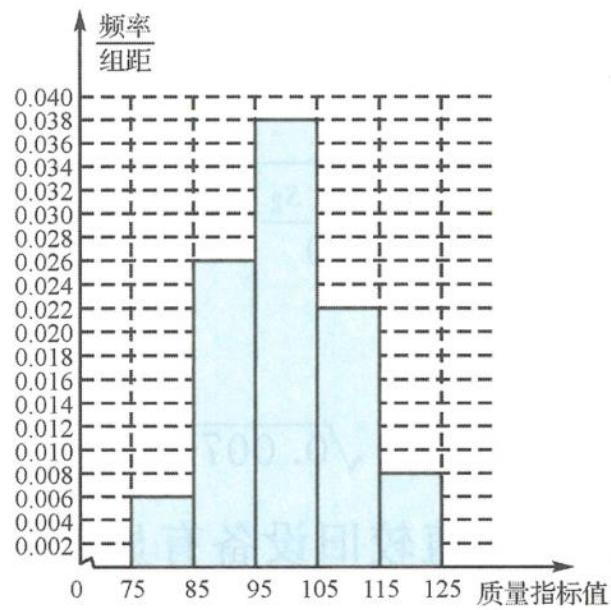

> [!faq]- 《高中数学新体系·概率统计的秘密》例题解析
>
> > [!success]- **【答案】** 详见解析
>
> > [!note]- **【分析】**
> > 本题未单列分析。
>
> > [!note]- **【解析】**
> > (I)频率分布直方图如下.
> > 
> > (Ⅱ)质量指标值的样本平均数为
> > $$
> > \overline {{x}} = 8 0 \times 0. 0 6 + 9 0 \times 0. 2 6 + 1 0 0 \times 0. 3 8 + 1 1 0 \times 0. 2 2 + 1 2 0 \times 0. 0 8 = 1 0 0.
> > $$
> > 质量指标值的样本方差为
> > $$
> > s ^ {2} = (- 2 0) ^ {2} \times 0. 0 6 + (- 1 0) ^ {2} \times 0. 2 6 + 0 \times 0. 3 8 + 1 0 ^ {2} \times 0. 2 2 + 2 0 ^ {2} \times 0. 0 8 = 1 0 4.
> > $$
> > 所以,这种产品质量指标值的平均数的估计值为 100,方差的估计值为 104.
> > (Ⅲ)质量指标值不低于95的产品所占比例的估计值为
> > $$
> > 0. 3 8 + 0. 2 2 + 0. 0 8 = 0. 6 8.
> > $$
> > 由于该估计值小于 0.8, 故不能认为该企业生产的这种产品符合“质量指标值不低于 95 的产品至少要占全部产品 80%”的规定.
> > 【探讨】能够根据抽样获取的数据按照数据处理的方法作频率分布表和频率分布直方图是数据处理的必备能力,本题提供了频数分布表,因此只需在此基础上作成频率分布表和频率分布直方图即可.我们在本题的基础上,进一步提高了要求,给出了原始数据,让考生自行整理,经历频数计数的过程,得到下列考题.
