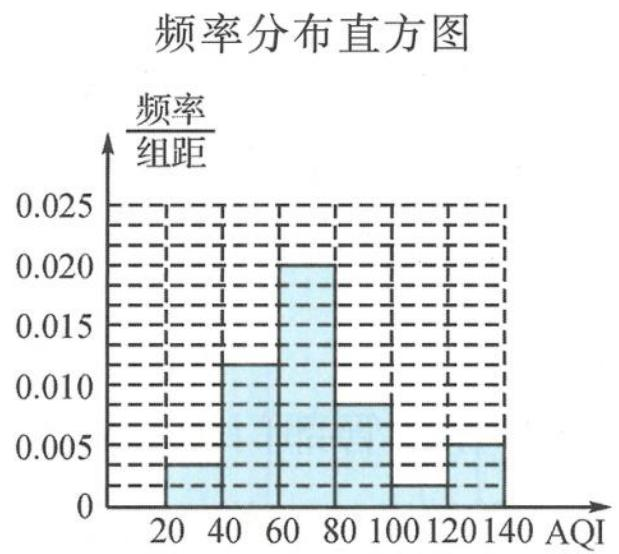

> [!faq]- 《高中数学新体系·概率统计的秘密》例题解析
>
> > [!success]- **【答案】** 详见解析
>
> > [!note]- **【分析】**
> > 本题未单列分析。
>
> > [!note]- **【解析】**
> > (I)频率分布表和频率分布直方图如下.
> > 2014年11月份AQI数据频率分布表
> > <table><tr><td>分组</td><td>频数</td><td>频率</td></tr><tr><td>[20,40)</td><td>2</td><td>1/15</td></tr><tr><td>[40,60)</td><td>7</td><td>7/30</td></tr><tr><td>[60,80)</td><td>12</td><td>2/5</td></tr><tr><td>[80,100)</td><td>5</td><td>1/6</td></tr><tr><td>[100,120)</td><td>1</td><td>1/30</td></tr><tr><td>[120,140]</td><td>3</td><td>1/10</td></tr></table>
> > (Ⅱ)支持,理由如下.
> > 
> > 2013年11月份的优良率为
> > $$
> > 2 0 \times \left(\frac {1}{3} \times 0. 0 0 5 + 0. 0 0 5 + 0. 0 1 5 + 0. 0 1 0\right) = \frac {1 9}{3 0},
> > $$
> > 2014年11月份的优良率为 $\frac{26}{30}$ , 因此
> > $$
> > \frac {2 6}{3 0} - \frac {1 9}{3 0} = \frac {7}{3 0} \approx 23. 3 \% > 20 \%.
> > $$
> > 所以,题中数据信息可支持“比去年同期空气质量的优良率提高了20多个百分点”.
> > 【探讨】本题数据来源是佛山本地真实的气象资料,展现环境治理的成果,引导学生关注当地环境.本题设计的问题让学生经历相对完整的数据处理过程,学会用数据说话,体现统计的作用与意义.考查的基础知识有频率分布直方图的识用与制作,频率的计算与频率分布表的制作,强化统计基本技能的考查.强调学会观察给出的频率分布直方图,制作新的频率分布直方图,会直观或量化比较不同的频率分布直方图,学会用比例关系处理不能整除的数据.解题思路:观察样例—分析制图—量化对比.
> > ## 拓展探讨题
