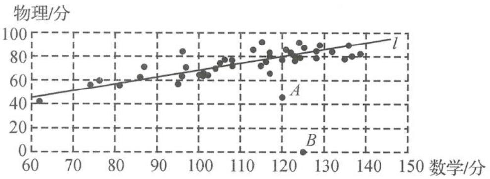

<!-- question-source:start -->
例题 2 下表中的数据是一次阶段性考试某班的数学、物理原始成绩(单位:分).

<table><tr><td>学号</td><td>1</td><td>2</td><td>3</td><td>4</td><td>5</td><td>6</td><td>7</td><td>8</td><td>9</td><td>10</td><td>11</td><td>12</td><td>13</td><td>14</td><td>15</td><td>16</td><td>17</td><td>18</td><td>19</td><td>20</td><td>21</td><td>22</td></tr><tr><td>数学</td><td>117</td><td>128</td><td>96</td><td>113</td><td>136</td><td>139</td><td>124</td><td>124</td><td>121</td><td>115</td><td>115</td><td>123</td><td>125</td><td>117</td><td>123</td><td>122</td><td>132</td><td>129</td><td>96</td><td>105</td><td>106</td><td>120</td></tr><tr><td>物理</td><td>80</td><td>84</td><td>83</td><td>85</td><td>89</td><td>81</td><td>91</td><td>78</td><td>85</td><td>91</td><td>72</td><td>76</td><td>87</td><td>82</td><td>79</td><td>82</td><td>84</td><td>89</td><td>63</td><td>73</td><td>77</td><td>45</td></tr><tr><td>学号</td><td>23</td><td>24</td><td>25</td><td>26</td><td>27</td><td>28</td><td>29</td><td>30</td><td>31</td><td>32</td><td>33</td><td>34</td><td>35</td><td>36</td><td>37</td><td>38</td><td>39</td><td>40</td><td>41</td><td>42</td><td>43</td><td>44</td></tr><tr><td>数学</td><td>108</td><td>137</td><td>87</td><td>95</td><td>108</td><td>117</td><td>104</td><td>128</td><td>125</td><td>74</td><td>81</td><td>135</td><td>101</td><td>97</td><td>116</td><td>102</td><td>76</td><td>100</td><td>62</td><td>86</td><td>120</td><td>101</td></tr><tr><td>物理</td><td>76</td><td>80</td><td>71</td><td>57</td><td>72</td><td>65</td><td>69</td><td>79</td><td>0</td><td>55</td><td>56</td><td>77</td><td>3</td><td>70</td><td>75</td><td>63</td><td>59</td><td>64</td><td>42</td><td>62</td><td>77</td><td>65</td></tr></table>

用这 44 人的两科成绩制作如下散点图.

学号为 22 号的同学由于严重感冒导致物理考试发挥失常, 学号为 31 号的同学因故未能参加物理学科的考试, 为了使分析结果更客观准确, 老师将 A, B 两名同学的成绩 (对应于图中 A, B 两点) 剔除后, 用剩下的 42 个同学的数据作分析, 计算得到下列统计指标.

数学学科平均分为 110.5, 标准差为 18.36; 物理学科的平均分为 74, 标准差为 11.18. 数学成绩 (x) 与物理成绩 (y) 的相关系数 r = 0.8222, 回归直线 l (如图所示) 的方程为 $\hat{y} = 0.5006x + 18.68$ .

(I)若不剔除 $A, B$ 两名同学的数据,用全部 44 人的成绩作回归分析,设数学成绩 $(x)$ 与物理成绩 $(y)$ 的相关系数为 $r_0$ , 回归直线为 $l_0$ , 试分析 $r_0$ 与 $r$ 的大小关系, 并在图中画出回归直线 $l_0$ 的大致位置.

(Ⅱ)如果 B 同学参加了这次物理考试,估计 B 同学的物理分数.(精确到个位)

(Ⅲ)就这次考试而言,学号为16号的C同学数学与物理哪个学科的成绩要好一些? (通常为了比较某个学生不同学科的成绩水平,可按公式 $Z_{i}=\frac{X_{i}-\overline{X}}{s}$ 统一化成标准分再进行比较,其中 $X_{i}$ 为学科原始分, $\overline{X}$ 为学科平均分,s为学科标准差).

【分析】第(Ⅰ)问重在对相关系数与回归直线的感性理解,与回归分析相关数据已准备充分,重在对数据的理解,在审题时,要注意从众多的信息(44人的数据)中找到关键信息(22号、31号、16号);第(Ⅱ)问直接用回归方程预报即可.第(Ⅲ)问先要理解公式中的各参数的意义,找到对应的数据,再进行计算比较,实质上是对考生学习能力的考查.
<!-- question-source:end -->

![[高中/总复习/专题/高考数学秘密/浙大优辅《高中数学新体系 概率统计的秘密》/第三章_统计/3_4_统计推断/3_4_2_相关分析与回归分析/questions/answers/Q00037846A1.md]]
