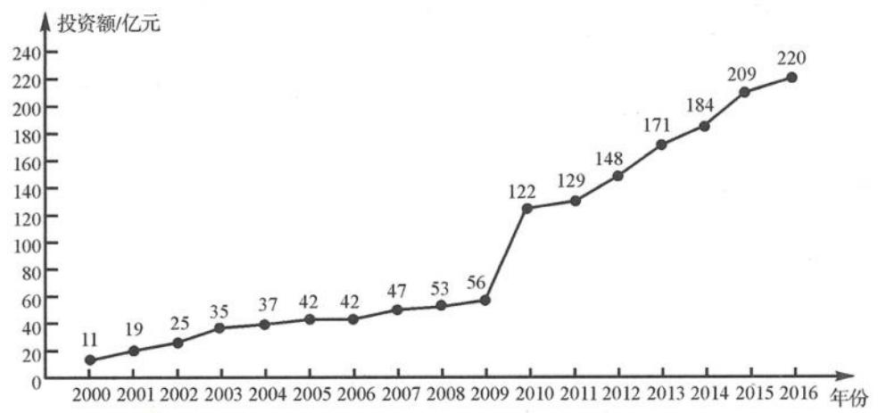

<!-- question-source:start -->
例题 3 下图是某地区 2000 年至 2016 年环境基础设施投资额 y(单位:亿元)的折线图.

为了预测该地区2018年的环境基础设施投资额,建立了y与时间变量t的两个线性回归模型.根据2000年至2016年的数据(时间变量t的值依次为1,2,…,17),建立模型①: $\hat{y}=-30.4+13.5t$ ;根据2010年至2016年的数据(时间变量t的值依次为1,2,…,7),建立模型②: $\hat{y}=99+17.5t$ .

(Ⅰ)分别利用这两个模型,求该地区2018年的环境基础设施投资额的预测值.

(Ⅱ)你认为用哪个模型得到的预测值更可靠？请说明理由.

【分析】本题命题导向很明确,不再是让学生计算回归分析中的参量,而是直接给出回归方程,聚焦回归解释.第(Ⅰ)问的设计为利用已建立的回归模型对环境基础设计投资额做预测,第(Ⅱ)问的设计为结合模型应用目的对模型的优劣进行简单讨论以及模型的选择.
<!-- question-source:end -->

![[高中/总复习/专题/高考数学秘密/浙大优辅《高中数学新体系 概率统计的秘密》/第三章_统计/3_4_统计推断/3_4_2_相关分析与回归分析/questions/answers/Q00037847A1.md]]
