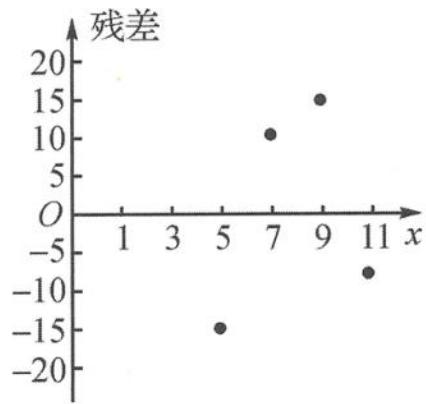

<!-- question-source:start -->
例题 4 2020 年是我国全面建成小康社会和“十三五”规划收官之年,也是佛山在经济总量超万亿元新起点上开启发展新征程的重要历史节点.作为制造业城市,佛山一直坚持把创新摆在制造业发展全局的前置位置和核心位置,聚焦打造成为面向全球的国家制造业创新中心,走“世界科技+佛山智造+全球市场”的创新发展之路.在推动制造业高质量发展的大环境下,佛山市某工厂统筹各类资源,进行了积极的改革探索.下表是该工厂每月生产的一种核心产品的产量 $x(5 \leqslant x \leqslant 20)$ (件)与相应的生产总成本 y(万元)的四组对照数据.

<table><tr><td>x</td><td>5</td><td>7</td><td>9</td><td>11</td></tr><tr><td>y</td><td>200</td><td>298</td><td>431</td><td>609</td></tr></table>

工厂研究人员建立了 y 与 x 的两种回归模型, 利用计算机算得近似结果如下.

模型①: $\hat{y}=\frac{x^{3}}{3}+173;$

模型②: $\hat{y}=68x-160.$

其中模型①的残差(实际值一预报值)图如图1所示.

（Ⅰ）根据残差分析，哪一个更适宜作为 y 关于 x 的回归方程？请说明理由.

图1

(Ⅱ)市场前景风云变幻,研究人员统计历年的销售数据得到每件产品的销售价格 q(万元)是一个与产量 x 相关的随机变量,分布列为

<table><tr><td>q</td><td>140-x/2</td><td>130-x/2</td><td>100-x/2</td></tr><tr><td>P</td><td>1/2</td><td>2/5</td><td>1/10</td></tr></table>

结合你对(Ⅰ)的判断,当产量 x 为何值时,月利润的预报期望值最大? 最大值是多少(精确到0.1)?

【分析】本题主要考查残差分析及其实际含义以及利用回归分析的函数特征结合期望构建函数进行决策.
<!-- question-source:end -->

![[高中/总复习/专题/高考数学秘密/浙大优辅《高中数学新体系 概率统计的秘密》/第三章_统计/3_4_统计推断/3_4_2_相关分析与回归分析/questions/answers/Q00037848A1.md]]
