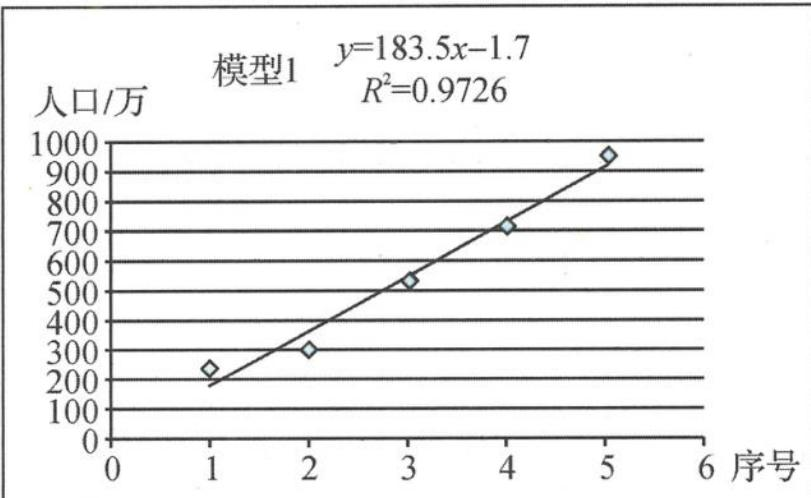
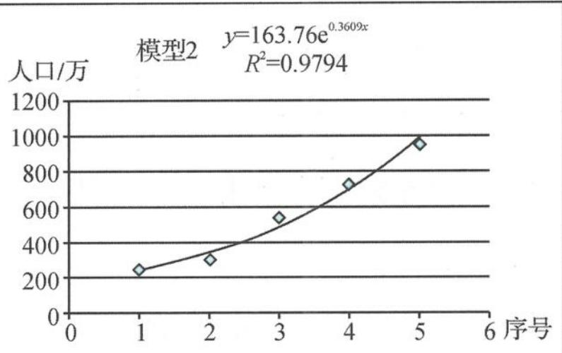

<!-- question-source:start -->
题 3 （多选题）2021 年 5 月 18 日，《佛山市第七次全国人口普查公报》发布。公报显示，佛山市常住人口为 9498863 人。为了进一步分析数据特征，某数学兴趣小组先将近五次人口普查数据作出散点图(横坐标为人口普查的序号,第三次普查记为1,……,第七次普查记为5,纵坐标为当次人口普查佛山市的人口数),再利用不同的函数模型作出回归分析,如下图,以下说法正确的是().

A.佛山市人口数与普查序号呈正相关关系B.散点的分布呈现出很弱的线性相关特征C.回归方程2的拟合效果更好D.应用回归方程1可以预测第八次人口普查时佛山市人口会超过1400万
<!-- question-source:end -->

![[Q00037851A1]]
