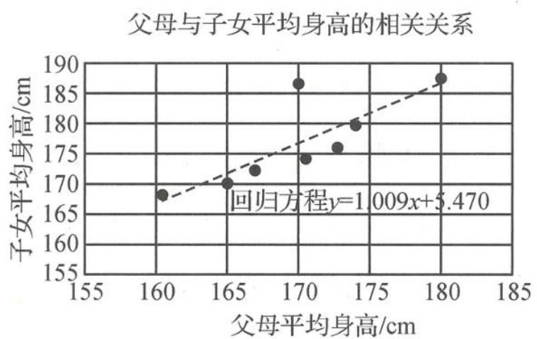

<!-- question-source:start -->
题 7 研究表明,子女的平均身高 $y_{i}$ (cm) 与父母的平均身高 $x_{i}$ (cm) 有较强的线性相关性. 某数学小组收集到 8 个家庭的相关数据,下面是小组制作的统计图(散点图、回归直线 l 及回归方程)与原始数据表(局部缺失).

<table><tr><td>家庭编号</td><td>1</td><td>2</td><td>3</td><td>4</td><td>5</td><td>6</td><td>7</td><td>8</td></tr><tr><td>父母平均身高/cm</td><td>160.5</td><td>165</td><td>167</td><td>170</td><td>170.5</td><td>173</td><td>174</td><td>180</td></tr><tr><td>子女平均身高/cm</td><td>168</td><td>170</td><td>172.5</td><td>187</td><td>174.5</td><td>176</td><td>180</td><td>*</td></tr></table>

(Ⅰ)表中8号家庭的子女平均身高数据缺失,试根据统计学知识找回该数据.

(Ⅱ)由图中观察到4号家庭的数据点明显偏离回归直线 $l$ , 试计算其残差 (残差 = 观测值 - 预报值). 若剔除4号家庭数据点后, 用余下的7个散点作线性回归分析, 得到新的回归直线 $l'$ , 判断并证明 $l$ 与 $l'$ 的位置关系.

附:对于一组数据 $(x_{1},y_{1}),(x_{2},y_{2}),\cdots,(x_{n},y_{n})$ ，其回归直线 $\hat{y}=\hat{b}x+\hat{a}$ 的斜率和截距的

最小二乘估计分别为： $\hat{b} = \frac{\sum_{i = 1}^{n}(x_i - \overline{x})(y_i - \overline{y})}{\sum_{i = 1}^{n}(x_i - \overline{x})^2} = \frac{\sum_{i = 1}^{n}x_iy_i - n\overline{x}\overline{y}}{\sum_{i = 1}^{n}x_i^2 - n\overline{x}^2},\hat{a} = \overline{y} -\hat{b}\overline{x}.$
<!-- question-source:end -->

![[Q00037855A1]]
