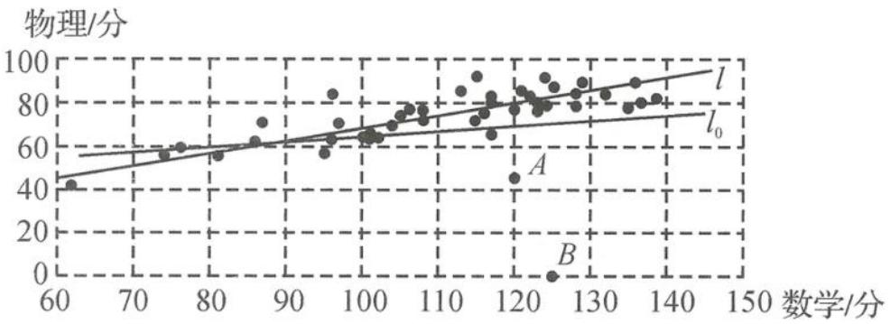

> [!faq]- 《高中数学新体系·概率统计的秘密》例题解析
>
> > [!success]- **【答案】** 详见解析
>
> > [!note]- **【分析】**
> > 本题未单列分析。
>
> > [!note]- **【解析】**
> > (Ⅰ) $r_{0}<r$ ，理由如下.
> > - **①**：离群点 A, B 会降低变量间的线性关联程度；
> > - **②**：44 个数据点与回归直线 $l_{0}$ 的总偏差更大, 回归效果更差, 所以相关系数更小;
> > - **③**：42 个数据点与回归直线 l 的总偏差更小, 回归效果更好, 所以相关系数更大;
> > - **④**：42 个数据点更加贴近回归直线 l;
> > - **⑤**：44 个数据点与回归直线 $l_{0}$ 更离散；
> > 其他言之有理的理由均可.
> > 
> > 要点: 直线 $l_{0}$ 的斜率须大于 0 且小于 l 的斜率, 具体位置稍有出入没关系, 无须说明理由.
> > (Ⅱ)令 x=125, 代入
> > $$
> > y = 0. 5 0 0 6 x + 1 8. 6 8 = 0. 5 0 0 6 \times 1 2 5 + 1 8. 6 8,
> > $$
> > 得
> > $$
> > y = 6 2. 5 7 5 + 1 8. 6 8 \approx 8 1.
> > $$
> > 所以,估计 B 同学的物理分数大约为 81 分.
> > (Ⅲ)由表可知 C 同学的数学原始分为 122, 物理原始分为 82, 数学标准分为
> > $$
> > Z _ {1 6} = \frac {x _ {1 6} - \overline {{{x}}}}{s _ {1}} = \frac {1 2 2 - 1 1 0 . 5}{1 8 . 3 6} = \frac {1 1 . 5}{1 8 . 3 6} \approx 0. 6 3,
> > $$
> > 物理标准分为
> > $$
> > Z _ {1 6} = \frac {y _ {1 6} - \overline {{{y}}}}{s _ {2}} = \frac {8 2 - 7 4}{1 1 . 1 8} = \frac {8}{1 1 . 1 8} \approx 0. 7 2.
> > $$
> > 因为 0.72 > 0.63，所以 C 同学物理成绩比数学成绩要好一些。
> > 【探讨】本题的现实背景是考生耳熟能详的经典的相关关系示例,在背景描述时尽量生活化,增加考生答题的适应性.数学背景之一是统计中的线性回归分析.考查相关系数与回归直线的感性理解,也渗透了对残差分析的思想.数学背景之二是不同学科成绩的比较问题,先按规则统一化成标准分,再进行比较.尝试做个统计学科普,既解决考生对不同学科成绩比较的疑惑,也考查了考生的学习能力.本题中涉及的重要概念有相关系数、回归直线与方程、残差分析、变量预报、标准化.
