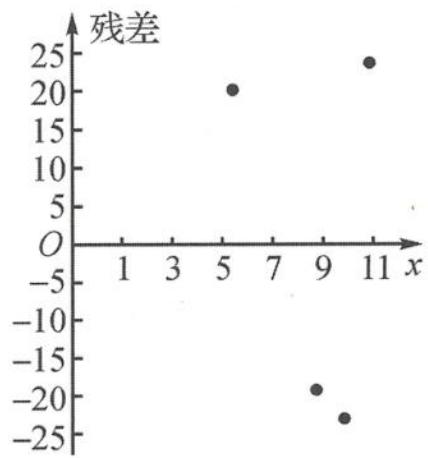

> [!faq]- 《高中数学新体系·概率统计的秘密》例题解析
>
> > [!success]- **【答案】** 详见解析
>
> > [!note]- **【分析】**
> > 本题未单列分析。
>
> > [!note]- **【解析】**
> > (I)模型②的残差数据如下表.
> > <table><tr><td>x</td><td>5</td><td>7</td><td>9</td><td>11</td></tr><tr><td>y</td><td>200</td><td>298</td><td>431</td><td>609</td></tr><tr><td> $\hat{e}$ </td><td>20</td><td>-18</td><td>-21</td><td>21</td></tr></table>
> > 模型②的残差图如图2所示.
> > 模型①更适宜作为 y 关于 x 的回归方程.
> > 理由 1: 模型①这 4 个样本点的残差的绝对值都比模型②的小.
> > 理由 2: 模型①这 4 个样本的残差点落在的带状区域比模型②的带状区域更窄.
> > 
> > 理由 3: 模型①这 4 个样本的残差点比模型②的残差点更贴近 x 轴.
> > 图2
> > (Ⅱ)设月利润为 Y, 由题意知 Y = qx - y, 则 Y 的分布列为
> > <table><tr><td>Y</td><td> $140x - \frac{x^2}{2} - \left( \frac{x^3}{3} + 173 \right)$ </td><td> $130x - \frac{x^2}{2} - \left( \frac{x^3}{3} + 173 \right)$ </td><td> $100x - \frac{x^2}{2} - \left( \frac{x^3}{3} + 173 \right)$ </td></tr><tr><td>P</td><td> $\frac{1}{2}$ </td><td> $\frac{2}{5}$ </td><td> $\frac{1}{10}$ </td></tr></table>
> > $$
> > \begin{array}{r l} E (Y) & = \left(1 4 0 x - \frac {x ^ {2}}{2} - \frac {x ^ {3}}{3} - 1 7 3\right) \times \frac {1}{2} + \left(1 3 0 x - \frac {x ^ {2}}{2} - \frac {x ^ {3}}{3} - 1 7 3\right) \times \frac {2}{5} + \left(1 0 0 x - \frac {x ^ {2}}{2} - \frac {x ^ {3}}{3} - 1 7 3\right) \times \frac {1}{1 0} \\ & = - \frac {x ^ {3}}{3} - \frac {x ^ {2}}{2} + 1 3 2 x - 1 7 3. \end{array}
> > $$
> > 设函数
> > $$
> > f (x) = - \frac {x ^ {3}}{3} - \frac {x ^ {2}}{2} + 1 3 2 x - 1 7 3, x \in (0, + \infty),
> > $$
> > 求导得
> > $$
> > f ^ {\prime} (x) = - x ^ {2} - x + 1 3 2.
> > $$
> > 令 $f'(x)=0$ ，解得 x=11 或 x=-12（舍去）.
> > 当 $x \in (0, 11)$ 时， $f'(x) > 0$ ，则 $f(x)$ 单调递增；当 $x \in (11, +\infty)$ 时， $f'(x) < 0$ ，则 $f(x)$ 单调递减。
> > 故函数 $f(x)$ 的最大值为 $f(11)=\frac{4649}{6}$ ，即产量为 11 件时，月利润的预报期望值最大，最大值是 774.8 万元。
> > 【探讨】本题的背景是制造业大市的佛山市的工厂智能制造转型升级.问题(Ⅰ)突出对残差的正确理解.可以通过计算和图形描述来进行.
> > ## 拓展探讨题
