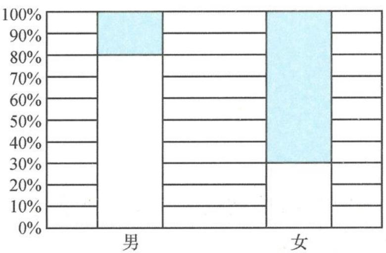

<!-- question-source:start -->
题 3 （多选题）为了增强学生的身体素质, 提高适应自然环境、克服困难的能力, 某校在课外活动中新增了一项登山活动, 并对“学生喜欢登山和性别是否有关”做了一次调查, 其中被调查的男、女学生人数相同, 得到如图所示的等高条形统计图. 下列说法中正确的有( ).

喜欢登山和性别情况条形统计图

□不喜欢 □喜欢

附： $K^2 = \frac{n(ad - bc)^2}{(a + b)(c + d)(a + c)(b + d)}$ ，其中 $n = a + b + c + d$

<table><tr><td>k</td><td>3.841</td><td>6.635</td></tr><tr><td>P(K2≥k)</td><td>0.050</td><td>0.010</td></tr></table>

A. 被调查的学生中喜欢登山的男生人数比喜欢登山的女生人数多
B. 被调查的女学生中喜欢登山的人数比不喜欢登山的人数多
C. 若被调查的男、女学生均为 100 人, 则有 $99\%$ 的把握认为喜欢登山和性别有关
D. 无论被调查的男、女学生人数为多少, 都有 $99\%$ 的把握认为喜欢登山和性别有关
<!-- question-source:end -->

![[Q00037863A1]]
