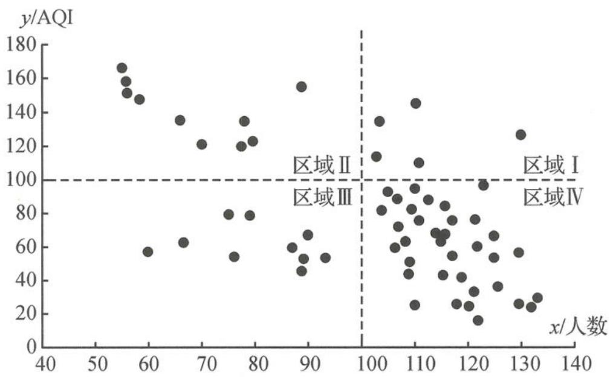

<!-- question-source:start -->
题 7 为了解空气质量指数(AQI)与参加户外健身运动的人数之间的关系,某校环保小组在暑假期间(60 天)进行了一项统计活动.每天记录到体育公园参加户外健身运动的人数,并与当天的 AQI 值(从气象部门获取)构成 60 组成对数据 $(x_{i},y_{i})(i=1,2,\cdots,60)$ ,其中 $x_{i}$ 为当天参加户外健身运动的人数, $y_{i}$ 为当天的 AQI 值,并制作了如下散点图.

连续 60 天参加健身运动人数与 AQI 散点图

（Ⅰ）环保小组准备做 y 与 x 的线性回归分析, 算得 y 与 x 的相关系数 $r \approx -0.58$ , 试分析 y 与 x 的线性相关关系?

(Ⅱ)环保小组还发现散点有分区聚集的特点,尝试作聚类分析.用直线 x=100 与 y=100 将散点图分成 I, II, III, IV 四个区域(如图),统计得到各区域的点数分别为 5,10,10,35,并初步认定“参加户外健身运动的人数不少于 100 与 AQI 值不大于 100 有关联”.问:该初步认定的犯错率是否小于 1%?

$$
\text { 附 }: K ^ {2} = \frac {n (a d - b c) ^ {2}}{(a + b) (c + d) (a + c) (b + d)}, \boxed { \begin{array}{l l l l} P (K ^ {2} \geqslant k) & 0. 0 5 0 & 0. 0 1 0 & 0. 0 0 1 \\ \hline k & 3. 8 4 1 & 6. 6 3 5 & 1 0. 8 2 8 \end{array} }
$$
<!-- question-source:end -->

![[Q00037867A1]]
