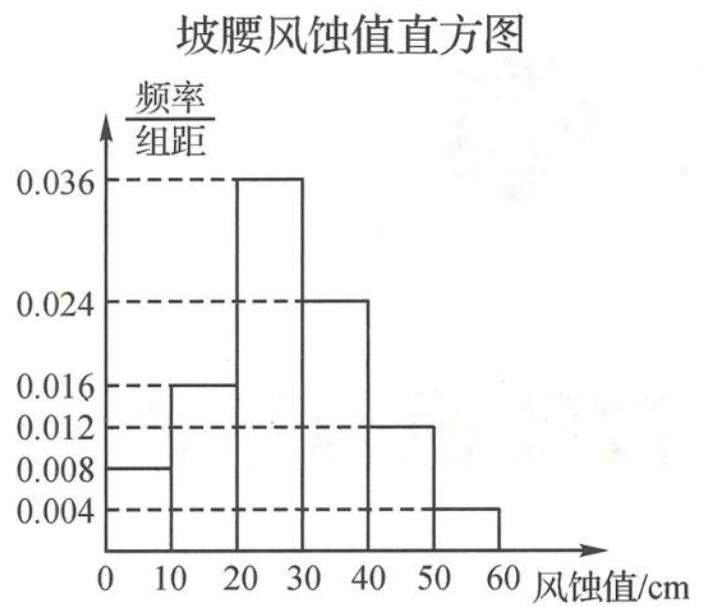
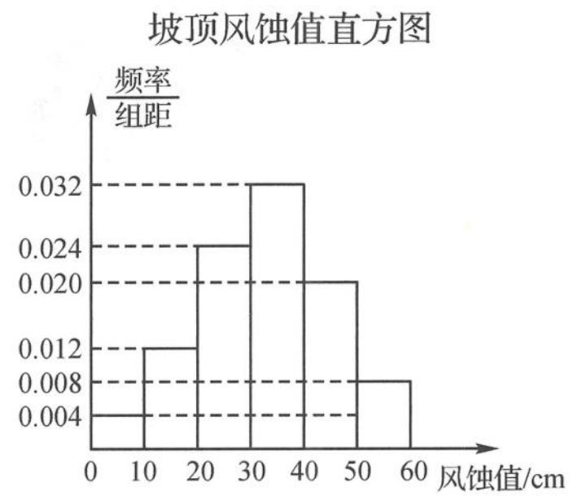

<!-- question-source:start -->
题 8 2019 年, 古浪县八步沙林场“六老汉”三代人治沙群体作为优秀代表, 被中宣部授予 “时代楷模”称号. 在治沙过程中, 为检测某种固沙方法的效果, 治沙人在某一试验沙丘的坡顶和坡腰各布设了 50 个风蚀插钎, 以测量风蚀值 (风蚀值是测量固沙效果的指标之一, 数值越小表示该插钎处被风吹走的沙层厚度越小, 说明固沙效果越好, 数值为 0 表示该插钎处没有被风蚀) 通过一段时间的观测, 治沙人记录了坡顶和坡腰全部插钎测得的风蚀值 (所测数据均不为整数), 并绘制了相应的频率分布直方图.

(Ⅰ)根据直方图估计“坡腰处一个插钎风蚀值小于30”的概率.

(Ⅱ)若一个插钎的风蚀值小于30,则该数据要标记“\*”,否则不标记.根据以上直方图,完成下面的列联表.

<table><tr><td>插钎位置</td><td>标记</td><td>不标记</td><td>合计</td></tr><tr><td>坡腰</td><td></td><td></td><td></td></tr><tr><td>坡顶</td><td></td><td></td><td></td></tr><tr><td>合计</td><td></td><td></td><td></td></tr></table>

问:是否有 95% 的把握认为数据标记“\*”与沙丘上插钎所布设的位置有关?

(Ⅲ)坡顶和坡腰的平均风蚀值分别为 $x_{1}$ 和 $x_{2}$ , 若 $\vert x_{1} - x_{2} \vert > 20 \mathrm{~cm}$ , 则可认为此固沙方法在坡顶和坡腰的固沙效果存在差异. 试根据直方图计算 $\overline{x}_{1}$ 和 $\overline{x}_{2}$ (同一组中的数据用该组区间的中点值代表), 问: 该固沙方法在坡顶和坡腰的固沙效果是否存在差异?

<table><tr><td rowspan="2">附:K2=naad-bc)2/(a+b)(c+d)(a+c)(b+d),</td><td>P(K2≥k)</td><td>0.050</td><td>0.010</td><td>0.001</td></tr><tr><td>k</td><td>3.841</td><td>6.635</td><td>10.828</td></tr></table>
<!-- question-source:end -->

![[Q00037868A1]]
