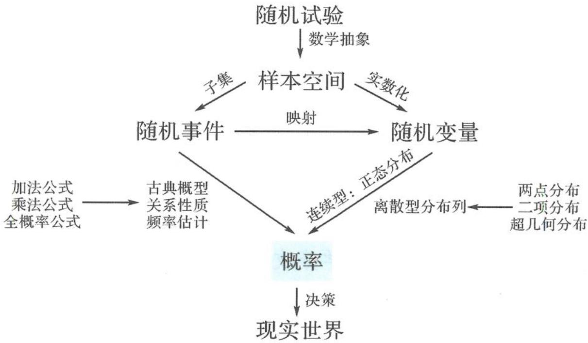

## 2.1 基本研究路径下的“概率”解题

概率论的研究对象就是随机现象,概率论为我们从不确定性的角度认识现实世界中的随机现象提供了思想与方法,而随机事件发生的可能性大小的数值就被称为概率.法国著名数学家拉普拉斯也曾说过:“生活中最重要的问题,绝大部分其实只是概率问题.”可见概率的重要性.

与统计相比,概率侧重于推理,概率是统计的基础.在本章中,随机事件和随机变量是两个重要的研究对象,本章的基本研究路径如图所示.

①要充分理解随机试验,并在此基础上建立样本空间,这样就能够利用集合语言比较方便地刻画随机事件.

②进一步明确复杂随机事件的关系或引入随机变量,常见的关系有相互独立关系和互斥关系,及由此带来的概率加法公式、乘法公式和全概率公式等计算工具.

③建立概率模型计算随机事件或随机变量的概率,高中阶段的概率模型有古典概率模型、频率估计概率模型、离散型分布模型(两点分布模型、超几何分布模型、二项分布模型)、正态分布模型等.

④在概率计算的基础上,做出数据特征的计算、推断和决策,进一步认识现实世界.

另外，在本章的学习过程中，要善于类比函数研究的一般路径来构建对随机现象和概率体系的研究，即通过对随机现象的分析，积极构建随机现象的研究路径、抽象概率的研究对象、建立概率的基本概念、发现和提出概率的性质、探索和形成研究随机现象的思路和方法，强化随机思想和随机方法，发展认识不确定现象的思维模式。

下面举一道例题说明随机问题研究的视角并开始我们对概率问题的研究之旅.

新人教版必修二 P241 例 12 为了推广一种新饮料,某饮料生产企业开展了有奖促销活动:将 6 罐这种饮料装一箱,每箱中都放置 2 罐能够中奖的饮料.若从一箱中随机抽取 2 罐,能中奖的概率为多少?

## 视角 1 古典概型

将 2 罐能够中奖的饮料记为 1,2,其余 4 罐饮料记为 3,4,5,6. 随机抽取 2 罐,则该试验的样本空间为 $\Omega = \{(m,n) | m, n \in \{1,2,3,4,5,6\}, m \neq n\}$ , 其中共有 30 个样本点且各个样本点出现的可能性相等.

设事件 $A =$ “中奖”，则 $A = \{(1,2),(1,3),(1,4),(1,5),(1,6),(2,1),(2,3),(2,4),$ $(2,5),(2,6),(3,1),(3,2),(4,1),(4,2),(5,1),(5,2),(6,1),(6,2)\}$ ，故 $n(A) = 18$ ，从而

$$
P (A) = \frac {n (A)}{n (\Omega)} = \frac {1 8}{3 0} = \frac {3}{5}.
$$

## 视角 2 事件关系与运算

设事件 A=“中奖”，事件 $A_{1}=$ “第一罐中奖”，事件 $A_{2}=$ “第二罐中奖”，则

$$
P (A) = 1 - P (\overline {{{{A _ {1}}}}} \overline {{{{A _ {2}}}}}) = 1 - \frac {1 2}{3 0} = \frac {3}{5}.
$$

或

$$
P (A) = P (A _ {1}) + P (\overline {{{{A _ {1}}}}} A _ {2}) = \frac {2}{6} + P (\overline {{{{A _ {1}}}}}) P (A _ {2} | \overline {{{{A _ {1}}}}}) = \frac {2}{6} + \frac {4}{6} \times \frac {2}{5} = \frac {3}{5}.
$$

## 视角 3 随机变量

设事件 A=“中奖”，抽取 2 罐中奖的罐数为 X，则

$$
P (A) = P (X \geqslant 1) = P (X = 1) + P (X = 2) = \frac {\mathrm{C} _ {2} ^ {1} \mathrm{C} _ {4} ^ {1}}{\mathrm{C} _ {6} ^ {2}} + \frac {\mathrm{C} _ {2} ^ {2}}{\mathrm{C} _ {6} ^ {2}} = \frac {8}{1 5} + \frac {1}{1 5} = \frac {3}{5}.
$$

或

$$
P (A) = 1 - P (X = 0) = 1 - \frac {\mathrm{C} _ {4} ^ {2}}{\mathrm{C} _ {6} ^ {2}} = 1 - \frac {6}{1 5} = \frac {3}{5}.
$$

## 视角 4 随机模拟频率估计概率

设事件 A=“中奖”，用计算机产生 1～6 的随机数，当出现随机数 1,2 时，表示抽到中奖的饮料，每 2 个随机数为一组。例如，产生 20 组随机数：

$$
6 3 5 6 2 5 1 1 2 1 5 3 6 5 4 5 5 5 5 4 4 1 2 3 3 5 4 5 2 3 3 2 6 2 2 5 3 5 1 2.
$$

其中,出现重复数字的无效数组有2组,对应数组分别为11,55;事件A发生了9次,对应数组分别为25,21,41,23,23,32,62,25,12.用频率估计事件A的概率近似为 $\frac{9}{18}=\frac{1}{2}$ .
