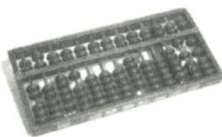

<!-- question-source:start -->
题 1-9 算盘是中国传统的计算工具, 其形长方, 周为木框, 内贯直柱, 俗称“档”, 档中横以梁, 梁上两珠, 每珠作数五, 梁下五珠, 每珠作数一. 算珠梁上部分叫上珠, 梁下部分叫下珠. 例如: 在十位档拨上一颗上珠和一颗下珠,

个位档拨上一颗上珠,则表示数字 65. 若在个、十、百、千位档中随机选择一档拨一颗上珠,再随机选择两个档位各拨一颗下珠,则所拨数字大于 200 的概率为( ). A. $\frac{3}{8}$ B. $\frac{1}{2}$ C. $\frac{2}{3}$ D. $\frac{3}{4}$
<!-- question-source:end -->

![[Q00037742A1]]
