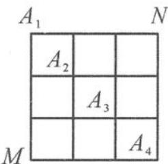

<!-- question-source:start -->
题 1-10 （多选题）如图, 在某城市的 M, N 两地之间有整齐的方格形道路网, 其中 $A_{1}$ , $A_{2}$ , $A_{3}$ , $A_{4}$ 是道路网中位于一条对角线上的 4 个交汇处. 今在道路网 M, N 处的甲、乙两人分别要到 N, M 处, 他们分别随机地选择一条沿街的最短路径, 以相同的速度同时出发, 直至到达 N, M 处. 则下列说法正确的是 ( ).

A. 甲从 M 到达 N 处的方法有 120 种

B. 甲从 M 必须经过 $A_{2}$ 到达 N 处的方法有 9 种

C. 甲、乙两人在 $A_{2}$ 处相遇的概率为 $\frac{81}{400}$ D. 甲、乙两人相遇的概率为 $\frac{41}{100}$

<!-- question-source:end -->

![[Q00037743A1]]
