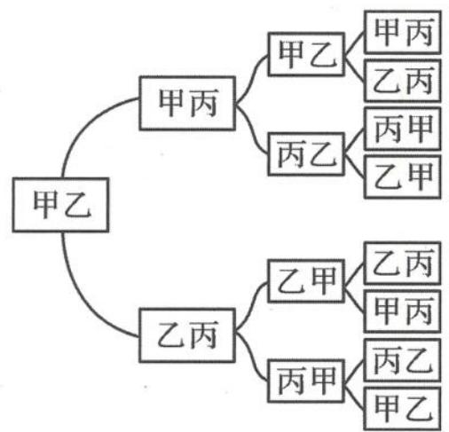

<!-- question-source:start -->
例题 2 甲、乙、丙三名同学进行羽毛球比赛,约定赛制如下:累计负两场者被淘汰;比赛前抽签决定首先比赛的两人,另一人轮空;每场比赛的胜者与轮空者进行下一场比赛,负者下一场轮空,直至有一人被淘汰;当一人被淘汰后,剩余的两人继续比赛,直至其中一人被淘汰,另一人最终获胜,比赛结束.

经抽签,甲、乙首先比赛,丙轮空.设每场比赛双方获胜的概率都为 $\frac{1}{2}$ .

(I)求甲连胜四场的概率.

(Ⅱ)求需要进行第五场比赛的概率.

(Ⅲ)求丙最终获胜的概率.

【分析】试题给我们呈现了一种三人比赛的方式,很多同学也许会觉得比较新颖,因此需要我们逐字阅读题目文字,弄懂比赛规则,并沿着这样的规则预演几次.

预演①:第一场甲和乙比赛,甲获胜;第二场甲和丙比赛,甲获胜;第三场甲和乙比赛,甲获胜、乙被淘汰;第四场甲和丙比赛,甲获胜、丙被淘汰.最终甲获胜.

预演②:第一场甲和乙比赛,甲获胜;第二场甲和丙比赛,丙获胜;第三场丙和乙比赛,乙获胜;第四场甲和乙比赛,乙获胜、甲被淘汰;第五场乙和丙比赛,丙获胜、乙被淘汰.最终丙获胜.

我们可以看到,预演①比较简洁,预演②相对复杂.当然,如果能把所有的预演情况都列举出来,即确定出样本空间,问题就相对容易.那么是否需要写出样本空间呢?或者说如何表示样本空间更方便简洁呢?(纯文字书写的确比较耗时)

“累计负两场者被淘汰”这个规则容易被遗忘,但这个规则对场次的确定有决定性作用,即最少四场、最多五场就能确定出胜者了.

【解析】设 A=“甲和乙比赛,甲获胜”,B=“甲和丙比赛,甲获胜”,C=“乙和丙比赛,乙获胜”.由题意知,

$$
P (A) = P (B) = P (C) = P (\overline {{{A}}}) = P (\overline {{{B}}}) = P (\overline {{{C}}}) = \frac {1}{2},
$$

各场次比赛相互独立.

(I) 设 M=“甲连胜四场”，则

$$
P (M) = P (A B A B) = P (A) P (B) P (A) P (B) = \left(\frac {1}{2}\right) ^ {4} = \frac {1}{1 6}.
$$

(Ⅱ)根据赛制,至少需要进行四场比赛,至多需要进行五场比赛.

比赛四场结束,共有三种情况,甲连胜四场比赛的概率为 $\frac{1}{16}$ ,乙连胜四场比赛的概率为 $\frac{1}{16}$ ,
丙上场后连胜三场比赛的概率为 $\frac{1}{8}$ ，所以需要进行五场比赛的概率

$$
P = 1 - \frac {1}{1 6} - \frac {1}{1 6} - \frac {1}{8} = \frac {3}{4}.
$$

(Ⅲ)丙最终获胜,有两种情况,比赛四场结束且丙最终获胜的概率为 $\frac{1}{8}$ ,比赛五场结束且丙最终获胜,则从第二场开始的四场比赛按丙的胜、负、轮空结果有三种情况:胜胜负胜、胜负空胜、负空胜胜.相应概率分别为 $\frac{1}{16}, \frac{1}{8}, \frac{1}{8}$ ,所以丙最终获胜的概率

$$
P = \frac {1}{8} + \frac {1}{1 6} + \frac {1}{8} + \frac {1}{8} = \frac {7}{1 6}.
$$

【探讨】本题重在考查学生的逻辑思维能力,对事件进行分析、分解和转化的能力,以及对概率的基础知识特别是古典概率模型、事件的关系和运算、事件独立性的掌握情况.学生很容易列出四场比赛的对阵双方共8种情况,四场比赛的结果,共有16种情况.解决第(Ⅱ)问,可以列出所有的16种情况,再逐一分析,很容易解决问题.但是如果要解决第(Ⅲ)问,全部列出所有的32种情况,就会显得比较复杂.因而就必须仔细分类:按照前面三场比赛结果分类.前面三场比赛结束,共有8种情况,再根据前面三场比赛的结果,分析第四场和第五场的比赛结果,来确保丙淘汰甲、乙,最终获胜.树形图常常有助于更好理解分类.

由于“五育并举”的需求,高考中体育这部分是最容易与概率结合在一起的,其中特别是各种球类运动,比赛规则常常是研究的切入点,是高考的热点问题.要特别重视规则以及规则下的分类讨论.

## (1)球类体育运动
<!-- question-source:end -->
