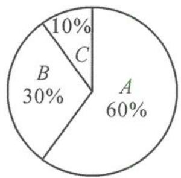

<!-- question-source:start -->
例题 2 某保险公司针对企业职工推出一款意外险产品,每年每人只要交少量保费,发生意外后可一次性获赔 50 万元.保险公司把职工从事的所有岗位共分为 A,B,C 三类工种,根据历史数据统计出三类工种的年赔付频率(并以此估计赔付概率)如下表.

<table><tr><td>工种类别</td><td>A</td><td>B</td><td>C</td></tr><tr><td>赔付频率</td><td> $\frac{1}{10^5}$ </td><td> $\frac{2}{10^5}$ </td><td> $\frac{1}{10^4}$ </td></tr></table>

（Ⅰ）根据规定，该产品各工种保单的期望利润都不得超过保费的 20%，试分别确定各类工种每张保单保费的上限。

(Ⅱ)某企业共有职工 20000 人,从事三类工种的人数分布比例如图所示,企业准备为全体职工每人购买一份此种保险,并以(Ⅰ)中计算的各类保费上限购买,试估计保险公司在这宗交易中的期望利润.

【分析】本题是我们命制的试题,在数据呈现上进行了创新,采取表格与饼图相结合的方式,强化图表阅读和信息整理.在数据提取时应注意两种图表中的关联数据,分别建立三个不同工种的保单利润的分布列,再依据期望利润不超过保费的20%,决定最高的定价.根据这个定价再计算保费,计算企业总保费后,根据最高保费与利润的关系可得总利润为保费的20%.在计算总保费时可有两种解题方式:一是直接计算总利润;二是先计算单份保单的利润,再用叠加思想计算总利润.具体来说,即建立概率分布列—计算最高保费—分析期望利润.
<!-- question-source:end -->

![[高中/总复习/专题/高考数学秘密/浙大优辅《高中数学新体系 概率统计的秘密》/第二章_概率/2_3_随机变量/2_3_1_随机变量与数字特征/questions/answers/Q00037775A1.md]]
