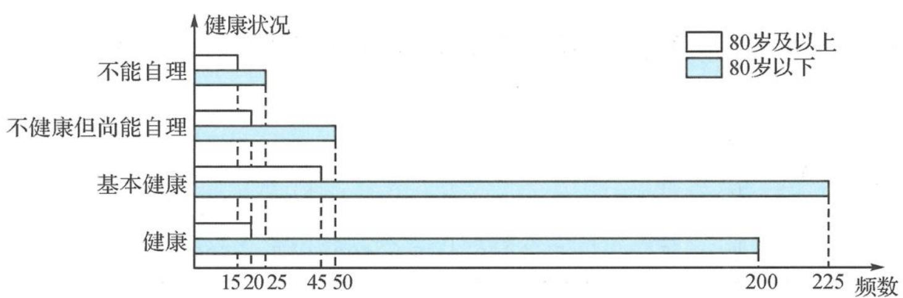

<!-- question-source:start -->
例题 5 我们国家正处于老龄化社会中,老有所依也是政府的民生工程.某市共有户籍人口400万,其中老人(年龄60岁及以上)人数约有66万,为了解老人们的健康状况,政府从老人中随机抽取600人并委托医疗机构免费为他们进行健康评估,健康状况共分为不能自理、不健康但尚能自理、基本健康、健康四个等级,并以80岁为界限分成两个群体进行统计,样本分布如下图.

老人健康状况统计图

(Ⅰ)若采用分层抽样的方法再从样本中的不能自理的老人中抽取8人进一步了解他们的生活状况,则两个群体中各应抽取多少人?
(Ⅱ)估算该市80岁及以上长者占全市户籍人口的百分比.
(Ⅲ)据统计该市大约有五分之一的户籍老人无固定收入,政府计划为这部分老人每月发放生活补贴,标准如下.
①80 岁及以上老人每人每月发放生活补贴 200 元；
②80岁以下老人每人每月发放生活补贴120元；
③不能自理的老人每人每月额外发放生活补贴 100 元.

试估计政府执行此计划的年度预算.
【分析】本题的数据呈现方式是考生不熟悉的横条状图,数据的提取学生不习惯,考查信息整理能力.在具体操作时,应及时整理成熟悉的式样(比如表格),为后面的问题提供精准的数据支撑.第(Ⅲ)问的概率分布列的建立,难点是寻找随机变量,因此要先确立随机变量为“月生活补贴”,再根据规则,明确取值情况及相应的概率,特别注意有交叉类别的取值,再用频率估计概率,为概率分布列准备条件,为期望计算奠定基础.解题路径为:确立随机变量—分析概率来源—计算数学期望.
<!-- question-source:end -->

![[高中/总复习/专题/高考数学秘密/浙大优辅《高中数学新体系 概率统计的秘密》/第二章_概率/2_3_随机变量/2_3_1_随机变量与数字特征/questions/answers/Q00037778A1.md]]
