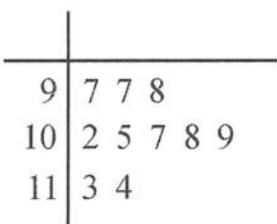

<!-- question-source:start -->
例题 3 未来制造业对零件的精度要求会越来越高. 3D 打印通常是采用数字技术材料打印机来实现的, 常在模具制造、工业设计等领域被用于制造模型, 后逐渐用于一些产品的直接制造. 目前已有使用这种技术打印而成的零部件.

该技术应用十分广泛,预计在未来会有广阔的发展空间.某制造企业向 A 高校 3D 打印实验团队租用一台 3D 打印设备,用于打印一批对内径有较高精度要求的零件.该团队在实验室打印出了一批这样的零件,从中随机抽取 10 个零件,测量得到其内径尺寸(单位: $\mu m$ )的茎叶图如图所示.

(I)计算内径尺寸的平均值 $\mu$ 与标准差 $\sigma$ .

(Ⅱ)假设这台3D打印设备打印出品的零件内径Z服从正态分布 $N(\mu,\sigma^{2})$ ，该团队到工厂安装调试后,试打了5个零件,测量得到其内径尺寸(单位: $\mu m$ )分别为86,95,103,109,118,试问此打印设备是否需要进一步调试?为什么?

参考数据： $P(\mu -2\sigma < Z < \mu +2\sigma)\approx 0.9545,P(\mu -3\sigma < Z < \mu +3\sigma)\approx 0.9973,0.9545^3\approx$ $0.87,0.9973^{4}\approx 0.99,0.0455^{2}\approx 0.002.$

【分析】正态分布要特别关注两个参变量的实际含义. 本题第(Ⅰ)问中茎叶图的理解, 熟练准确求解样本数据的平均值 $\mu$ 与标准差 $\sigma$ , 为正态分布准备相应参数. 第(Ⅱ)问实则是生产实践中质量控制的 $3\sigma$ 原则的认识和理解, 利用最大似然法进行科学决策. 解题思路: 数据呈现—数据处理—科学决策.
<!-- question-source:end -->

![[高中/总复习/专题/高考数学秘密/浙大优辅《高中数学新体系 概率统计的秘密》/第二章_概率/2_3_随机变量/2_3_2_重要的概率分布模型/questions/answers/Q00037790A1.md]]
