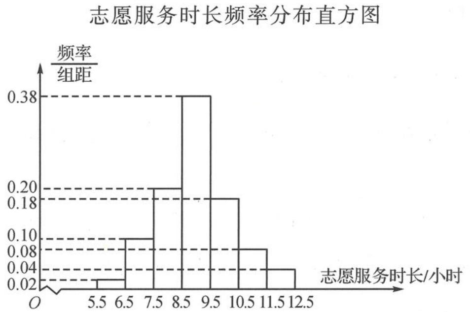

<!-- question-source:start -->
题 11 2020 年,某地在全国志愿服务信息系统注册登记志愿者 8 万多人.2019 年 7 月份以来,共完成 1931 个志愿服务项目,8900 多名志愿者开展志愿服务活动累计超过 150 万小时.为了了解此地志愿者对志愿服务的认知和参与度,随机调查了 500 名志愿者每月的志愿服务时长(单位:小时),并绘制如图所示的频率分布直方图.

(I)求这500名志愿者每月志愿服务时长的样本平均数 $\bar{x}$ 和样本方差 $s^2$ . (同一组中的数据用该组区间的中间值代表)

(Ⅱ)由直方图可以认为,目前该地志愿者每月服务时长 X 服从正态分布 $N(\mu,\sigma^{2})$ , 其中 $\mu$ 近似为样本平均数 $\bar{x}, \sigma^{2}$ 近似为样本方差 $s^{2}$ . 一般正态分布的概率都可以转化为标准正态分布的概率进行计算. 若 $X \sim N(\mu, \sigma^{2})$ , 令 $Y = \frac{X - \mu}{\sigma}$ , 则 $Y \sim N(0,1)$ , 且 $P(X \leqslant a) = P\left(Y \leqslant \frac{a - \mu}{\sigma}\right)$ .

(i) 利用直方图得到的正态分布, 求 $P(X \leqslant 10)$ ;

(ii)从该地随机抽取20名志愿者,记Z表示这20名志愿者中每月志愿服务时长超过10小时的人数,求 $P(Z \geqslant 1)$ (结果精确到0.001)以及Z的数学期望.

参考数据： $\sqrt{1.64} \approx 1.28, 0.7734^{20} \approx 0.0059$ . 若 $Y \sim N(0,1)$ ，则 $P(Y \leqslant 0.78) \approx 0.7734$ .
<!-- question-source:end -->

![[Q00037802A1]]
