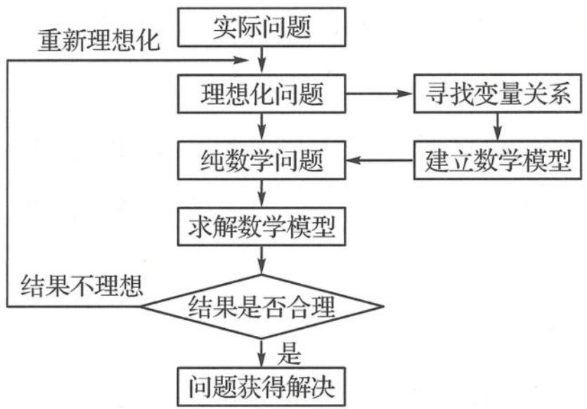

## 4.1 函数模型

## 基本概念解读

## 问题 1 什么是数学建模？

数学建模就是运用数学化的手段从实际问题中提炼、抽象出一个数学模型,求出模型的解,检验模型的合理性,从而使这一实际问题得以解决的过程.

数学模型就是用数学语言、符号来描述客观事物的特征及其内在联系的数学结构表达式. 数学建模流程如下.

问题 2 概率统计中的数学建模有什么特点？

试题命制需要经历“素材的选取”“情境的构造”“问题的提出”等环节,概率统计建模类问题的命制在素材选取上尽可能围绕着学生熟悉的身边的生产生活等具有随机现象特征的实际问题.在情境构造上尽可能讲清楚基础随机变量产生的来源以及需要做出决策研究的目标随机变量,随机分布列可以采用统计数据产生的频率替代,也可以是具体的概率分布模型.在设问上,可以采取递进式设问,即先研究基础随机变量的分布列,再研究目标变量分布列以及期望决策.

## 典型考题探讨

![[高中/总复习/专题/高考数学秘密/浙大优辅《高中数学新体系 概率统计的秘密》/第四章_模型视角下的概率统计/4_1_函数模型/questions/Q00037869.md]]
![[高中/总复习/专题/高考数学秘密/浙大优辅《高中数学新体系 概率统计的秘密》/第四章_模型视角下的概率统计/4_1_函数模型/questions/Q00037870.md]]
![[高中/总复习/专题/高考数学秘密/浙大优辅《高中数学新体系 概率统计的秘密》/第四章_模型视角下的概率统计/4_1_函数模型/questions/Q00037871.md]]
![[高中/总复习/专题/高考数学秘密/浙大优辅《高中数学新体系 概率统计的秘密》/第四章_模型视角下的概率统计/4_1_函数模型/questions/Q00037872.md]]
![[高中/总复习/专题/高考数学秘密/浙大优辅《高中数学新体系 概率统计的秘密》/第四章_模型视角下的概率统计/4_1_函数模型/questions/Q00037873.md]]
![[高中/总复习/专题/高考数学秘密/浙大优辅《高中数学新体系 概率统计的秘密》/第四章_模型视角下的概率统计/4_1_函数模型/questions/Q00037874.md]]
![[高中/总复习/专题/高考数学秘密/浙大优辅《高中数学新体系 概率统计的秘密》/第四章_模型视角下的概率统计/4_1_函数模型/questions/Q00037875.md]]
![[高中/总复习/专题/高考数学秘密/浙大优辅《高中数学新体系 概率统计的秘密》/第四章_模型视角下的概率统计/4_1_函数模型/questions/Q00037876.md]]
![[高中/总复习/专题/高考数学秘密/浙大优辅《高中数学新体系 概率统计的秘密》/第四章_模型视角下的概率统计/4_1_函数模型/questions/Q00037877.md]]
![[高中/总复习/专题/高考数学秘密/浙大优辅《高中数学新体系 概率统计的秘密》/第四章_模型视角下的概率统计/4_1_函数模型/questions/Q00037878.md]]
![[高中/总复习/专题/高考数学秘密/浙大优辅《高中数学新体系 概率统计的秘密》/第四章_模型视角下的概率统计/4_1_函数模型/questions/Q00037879.md]]
![[高中/总复习/专题/高考数学秘密/浙大优辅《高中数学新体系 概率统计的秘密》/第四章_模型视角下的概率统计/4_1_函数模型/questions/Q00037880.md]]
![[高中/总复习/专题/高考数学秘密/浙大优辅《高中数学新体系 概率统计的秘密》/第四章_模型视角下的概率统计/4_1_函数模型/questions/Q00037881.md]]

## 研究路径探索

由上述例题的分析与解,我们可以得到概率统计建模问题解决的基本研究路径:

弄清楚问题情境,明确要解决问题的含义→明确基础随机变量及其分布列→明确目标随机变量→构建两个随机变量之间的函数模型→确定目标随机变量的分布列→利用期望(方差)决策.
