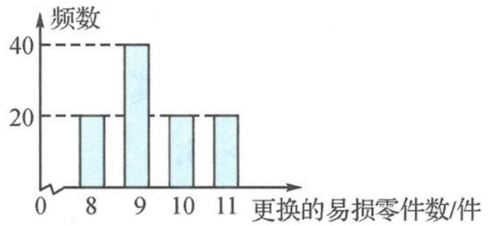

<!-- question-source:start -->
例题 2 某公司计划购买 2 台机器,该种机器使用三年后即被淘汰.机器有一易损零件,在购进机器时,可以额外购买这种零件作为备件,每个 200 元,在机器使用期间,如果备件不足再购买,则每个 500 元.现需决策在购买机器时应同时购买几个易损零件,为此搜集并整理了 100 台这种机器在三年使用期内更换的易损零件数,得到下面的柱状图.

以这 100 台机器更换的易损零件数的频率代替一台机器更换的易损零件数发生的概率,记 X 表示 2 台机器三年内共需更换的易损零件数,n 表示购买 2 台机器的同时购买的易损零件数.

(Ⅰ)求 X 的分布列.

(Ⅱ)若要求 $P(X \leqslant n) \geqslant 0.5$ ，确定 n 的最小值.

（Ⅲ）以购买易损零件所需费用的期望值为决策依据，在 $n = 19$ 与 $n = 20$ 之中选其一，应选用哪个？

【分析】本题以企业的成本控制为背景,着眼于“最优化零部件采购量”的决策问题设计和设问.

由于更换的易损零件数具有不确定性(对应例题1的“日需求量”), 因此需要建立随机模型并应用统计与概率的知识确定最优的备件购买量(例题1的“进货量”). 为解决这个问题, 需要把握易损零件数的不确定性, 即确定或近似确定易损零件数的分布列. 整理过去100台机器更换的易损零件数柱状图, 利用频率估计概率的思想获得需要更换的易损零件数的分布列, 然后计算所需费用的期望值, 该期望值与备件n有关. 以期望值的最小化为决策依据确定最优购买量. 本题要求在n=19和n=20中选择其一是为了控制运算量, 与例题1中要求进货量m=16和17的思路一致. 原则上讲, 应该计算全部备件(进货量)的费用, 然后比较才恰当. 命题时显然出于减少运算量的目的, 选择了一个最优值和次最优值进行比较确定. 当然, 本题在例题1的基础上增加了问题的复杂度, 研究两台机器需要更换易损零件数, 主要表现在强化了独立事件分解的概率计算要求.

【解析】①通过阅读弄清楚题意.上述对比分析的过程就是弄清题意的过程.不同的是,本题创设的是一个生产情境.

②确定基础随机变量及其分布列.

实际上,本题给出了三个随机变量之间的关系,其中最底层的是一台机器易损零件数 $X'$ 这个底层基础随机变量,而聚焦的两台机器易损零件数X这个基础随机变量与购买易损零件所需费用Y这个随机变量之间的数量关系,这是一个包含三个随机变量之间关系的问题,层层关联.因此应先研究一台机器易损零件数 $X'$ 的分布列.

题目中给出了 100 台这种机器在三年使用期内更换的易损零件数的统计数据(柱状图)，并明确将频率视作概率,因此可以得到 $X'$ 的分布列为

<table><tr><td>X&#x27;</td><td>8</td><td>9</td><td>10</td><td>11</td></tr><tr><td>P</td><td>0.2</td><td>0.4</td><td>0.2</td><td>0.2</td></tr></table>

由于两台机器相互独立,根据事件分解,将复杂事件分解为独立事件的积与互斥事件的和.因此可以得到 X 的分布列为

<table><tr><td>X</td><td>16</td><td>17</td><td>18</td><td>19</td><td>20</td><td>21</td><td>22</td></tr><tr><td>P</td><td>0.04</td><td>0.16</td><td>0.24</td><td>0.24</td><td>0.2</td><td>0.08</td><td>0.04</td></tr></table>

具体计算过程如下.

$$
P (X = 1 6) = 0. 2 \times 0. 2 = 0. 0 4,
$$

$$
P (X = 1 7) = 2 \times 0. 2 \times 0. 4 = 0. 1 6,
$$

$$
P (X = 1 8) = 2 \times 0. 2 \times 0. 2 + 0. 4 \times 0. 4 = 0. 2 4,
$$

$$
P (X = 1 9) = 2 \times 0. 2 \times 0. 2 + 2 \times 0. 4 \times 0. 2 = 0. 2 4,
$$

$$
P (X = 2 0) = 2 \times 0. 2 \times 0. 4 + 0. 2 \times 0. 2 = 0. 2,
$$

$$
P (X = 2 1) = 2 \times 0. 2 \times 0. 2 = 0. 0 8,
$$

$$
P (X = 2 2) = 0. 2 \times 0. 2 = 0. 0 4.
$$

注意到

$$
P (X \leqslant 1 8) = 0. 0 4 + 0. 1 6 + 0. 2 4 = 0. 4 4,
$$

$$
P (X \leqslant 1 9) = 0. 4 4 + 0. 2 4 = 0. 6 8,
$$

故 n 的最小值为 19. 这个是题目中第(Ⅱ)问的解答.

③构建基础随机变量与目标随机变量之间的函数模型.

题设中给出“在购进机器时,可以额外购买这种零件作为备件,每个200元;在机器使用期间,如果备件不足再购买,则每个500元”以及“表示购买两台机器同时购买的零件数”这两部分语言描述,实际上这等于给出了构建易损件X与购买易损零件数所需费用Y之间的函数关系:

$$
Y = \left\{ \begin{array}{l} 2 0 0 n, X \leqslant n, \\ 2 0 0 n + (X - n) \times 5 0 0, X > n. \end{array} \right.
$$

④确定目标随机变量的分布列.

题目给了备件为 $n = 19$ 与 $n = 20$ 两种情形，并探索比较进行分析决策，因此需要研究这两种情形下的分布列和期望费用.

当 $n = 19$ 时，

$$
Y = \left\{ \begin{array}{l} 3 8 0 0, X \leqslant 1 9, \\ 5 0 0 X - 5 7 0 0, X > 1 9. \end{array} \right.
$$

此时,费用 Y 的分布列为

<table><tr><td>Y</td><td>3800</td><td>4300</td><td>4800</td><td>5300</td></tr><tr><td>P</td><td>0.68</td><td>0.2</td><td>0.08</td><td>0.04</td></tr></table>

类似地，当 $n = 20$ 时，

$$
Y = \left\{ \begin{array}{l} 4 0 0 0, X \leqslant 2 0, \\ 5 0 0 X - 6 0 0 0, X > 2 0. \end{array} \right.
$$

此时,费用 Y 的分布列为

<table><tr><td>Y</td><td>4000</td><td>4500</td><td>5000</td></tr><tr><td>P</td><td>0.88</td><td>0.08</td><td>0.04</td></tr></table>

⑤利用期望决策.

当 $n = 19$ 时，

$$
E (Y) = 3 8 0 0 \times 0. 6 8 + 4 3 0 0 \times 0. 2 + 4 8 0 0 \times 0. 0 8 + 5 3 0 0 \times 0. 0 4 = 4 0 4 0 (\text {元});
$$

当 $n = 20$ 时，

$$
E (Y) = 4 0 0 0 \times 0. 8 8 + 4 5 0 0 \times 0. 0 8 + 5 0 0 0 \times 0. 0 4 = 4 0 8 0 (\text {元}).
$$

可知, 当 n=19 时所需费用的期望值小于当 n=20 时所需费用的期望值, 故应选 n=19.

【探讨】本题是2016年全国Ⅰ卷理科第19题.相比于例题1,本题将建模要求隐藏在文字描述中(其实这部分阅读要求没有太大变化),频率呈现从表变成了柱形图,同时将基础随机变量设计成了两层,增加了事件分解和概率计算的要求,其他没有任何变化.在文字陈述的段落分布和设问上没有变化,在问题解决上保持了一致.
<!-- question-source:end -->
