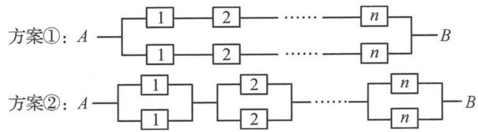

<!-- question-source:start -->
题 3 随着现代电子技术的迅猛发展,关于元件和系统可靠性的研究已发展成为一门新的学科——可靠性理论.在可靠性理论中,一个元件正常工作的概率称为该元件的可靠性.元件组成系统,系统正常工作的概率称为该系统的可靠性.现有 $n(n \in \mathbb{N}^{*}, n \geqslant 2)$ 种电子元件,每种 2 个,每个元件的可靠性均为 $p(0 < p < 1)$ .当某元件不能正常工作时,该元件在电路中将形成断路.现要用这 2n 个元件组成一个电路系统,有如下两种连接方案可供选择,当且仅当从 A 到 B 的电路为通路状态时,系统正常工作.

(I)(i)分别写出按方案①和方案②建立的电路系统的可靠性 $P_{1}, P_{2}$ (用 $n$ 和 $p$ 表示);

(ii) 比较 $P_{1}$ 与 $P_{2}$ 的大小, 说明哪种连接方案更稳定可靠.

(Ⅱ)设 $n=4, p=\frac{4}{5}$ ，已知按方案②建立的电路系统可以正常工作，记此时系统中损坏的元件个数为 X，求随机变量 X 的分布列和数学期望.
<!-- question-source:end -->

![[Q00037876A1]]
