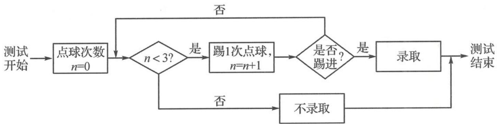

<!-- question-source:start -->
题 4 为推广足球运动,某学校成立了足球社团,由于报名人数较多,需对报名者进行“点球测试”来决定是否录取,规则如下.

(I)下表是某同学6次的训练数据,以这150个点球中的进球频率代表其单次点球踢进的概率.为加入足球社团,该同学进行了“点球测试”,每次点球是否踢进相互独立,将他在测试中所踢的点球次数记为 $\xi$ ,求 $E(\xi)$ .

<table><tr><td>点球数</td><td>20</td><td>30</td><td>30</td><td>25</td><td>20</td><td>25</td></tr><tr><td>进球数</td><td>10</td><td>17</td><td>20</td><td>16</td><td>13</td><td>14</td></tr></table>

(Ⅱ)社团中的甲、乙、丙三名成员将进行传球训练,从甲开始随机地将球传给其他两人中的任意一人,接球者再随机地将球传给其他两人中的任意一人,如此不停地传下去,且假定每次传球都能被接到.记开始传球的人为第1次触球者,接到第 $n(n \in \mathbf{N}^{*})$ 次传球的人即为第 $n+1$ 次触球者,第n次触球者是甲的概率记为 $P_{n}$ .

(i) 求 $P_{1}, P_{2}, P_{3}$ ; (直接写出结果即可)

(ii) 证明: 数列 $\left\{P_{n}-\frac{1}{3}\right\}$ 为等比数列.
<!-- question-source:end -->

![[Q00037888A1]]
