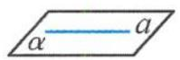
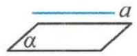
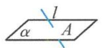
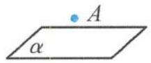
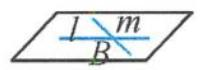
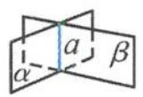

## 3.1 借用符号

数学需要借助于符号语言进行运算与推理的表达,立体几何并不例外,例如:点、直线、平面之间的位置关系的表达常有文字语言、图形语言和符号语言,具体见表3.1-1.

表 3.1-1

<table><tr><td>文字语言</td><td>图形语言</td><td>符号语言</td><td>文字语言</td><td>图形语言</td><td>符号语言</td></tr><tr><td>点A在直线a上</td><td></td><td>A ∈ a</td><td>直线a在平面α内</td><td></td><td>A⊂α</td></tr><tr><td>点A在直线a外</td><td></td><td>A∉a</td><td>直线a不在平面α内</td><td></td><td>A∉α</td></tr><tr><td>点A在平面α内</td><td></td><td>A ∈ α</td><td>直线l与平面α相交于点A</td><td></td><td>l∩α=A</td></tr><tr><td>点A在平面α外</td><td></td><td>A∉α</td><td>直线l与直线m相交于点B</td><td></td><td>l∩m=B</td></tr><tr><td></td><td></td><td></td><td>平面α与平面β相交于直线a</td><td></td><td>α∩β=a</td></tr></table>

在立体几何中我们用到的符号都是被大家所熟悉的集合中的符号,但是立体几何只是借其形而没有用其意,所以这里的符号不按集合的语言来读,也不按集合的意义来理解,只是借用而已.若单纯地从集合语言的角度来解释立体几何中符号的意义,就会出现知识之间的互相矛盾.数学证明过程就是用符号表示推理,所以我们需要正确地认识符号,理解符号,从而正确地使用符号,切勿随心所欲地使用符号.
