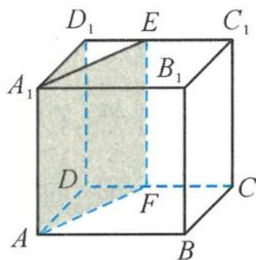

> [!faq]- 《浙大优辅《高中数学新体系 立体几何的秘密》》例题解析
>
> > [!success]- **【答案】** D
>
> > [!note]- **【分析】**
> > 本题未单列分析。
>
> > [!note]- **【解析】**
> > 解答 这个问题虽然无关乎正方体,但是如果把问题放在正方体中来解决,就会变得驾轻就熟.
> > 如图 3.2-1, 在正方体 $ABCD-A_{1}B_{1}C_{1}D_{1}$ 中, E, F 分别是棱 $D_{1}C_{1}$ 与 DC 上的任一点 (不包括端点), 则二面角 $D-AA_{1}-F$ 与二面角 $D_{1}-DC-A$ 满足条件, 但这两个二面角的平面角既不相等, 也不互补.
> > 
> > 图3.2-1
> >
> > 故选 **D**.
