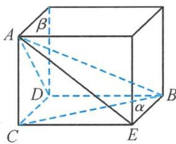

> [!faq]- 《浙大优辅《高中数学新体系 立体几何的秘密》》例题解析
>
> > [!success]- **【答案】** B
>
> > [!note]- **【分析】**
> > 本题未单列分析。
>
> > [!note]- **【解析】**
> > 解答 如图 3.2-2, 得直二面角 $\alpha - CD - \beta$ , 线段 $AB$ 的两个端点满足 $A \in \beta, B \in \alpha, AC \perp \alpha$ , $BD \perp \beta$ , 则
> > $$
> > \angle A B C = 3 0 ^ {\circ}, \angle D A B = 3 0 ^ {\circ},
> > $$
> > 且 $\angle ABE$ 为直线 AB 与这个二面角的棱所成角或补角.
> > 在 Rt△ABE 中, 易求
> > $$
> > \angle A B E = 4 5 ^ {\circ}.
> > $$
> > 
> > 图3.2-2
> > 故选 B.
> > 点评 借助于长方体,我们将三个空间角一起敲定,这是两全其美的事情.当题目没有给出具体的图形,只是给出了点、线、面的位置关系(如平行、垂直等),要判断某些元素的位置关系或求角等,通常可考虑借用正方体或长方体模型,把这些线、面变成正方体中的线段或某一个面,进而将问题快速而准确地解决.
