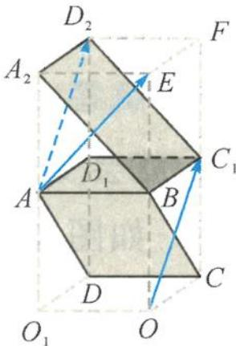
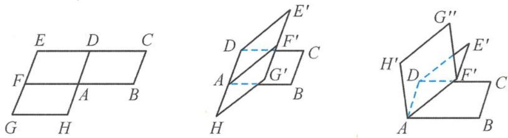
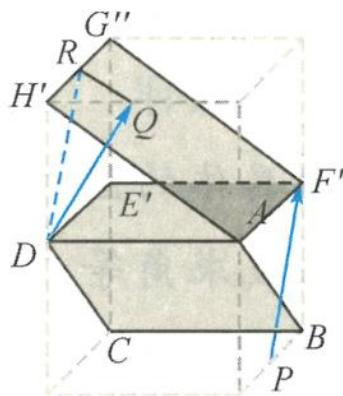

> [!faq]- 《浙大优辅《高中数学新体系 立体几何的秘密》》例题解析
>
> > [!success]- **【答案】** 详见解析
>
> > [!note]- **【分析】**
> > 分析 本题解答的困难之处就在于需要比较高的空间想象能力,而
> >
> > 且二面角是“隐棱”的类型, 又给解题雪上加霜. 但题目中隐含着重要信息——重复出现的正方形与角 $45^{\circ}$ . 这给我们一个明确而有用的解题暗示——正方体. 借用正方体, 旋转起来就不再会“晕图”了. 借一个“形”, 轻松搞定二面角; 借一个“形”, 使得原图形“舒展”开来, 不再是“螺蛳壳里做道场”; 借一个“形”, 一切都变得豁然开朗, 问题也迎刃而解.
> >
> > 解答 如图3.2-4, 把图形放入全等的正方体 $ABC_{1}D_{1}-O_{1}OCD$ 与正方体 $ABC_{1}D_{1}-A_{2}EFD_{2}$ , 这不仅是眼前一亮的视觉冲击, 而且更多的解题趣味是“一切尽在不言中”.
> >
> > 问题就悄然地转化为求平面 $A_{2}BC_{1}D_{2}$ 的法向量与平面 ABCD 的法向量所成的角. 而平面 ABCD 的法向量为 $\overrightarrow{OC_{1}}$ , 平面 $A_{2}BC_{1}D_{2}$ 的法向量为 $\overrightarrow{AE}$ .
> >
> > 另外, $OC_{1} \parallel AD_{2}$ , 所以只要求向量 $\overrightarrow{AE}$ 与向量 $\overrightarrow{AD_{2}}$ 的夹角, 而 $\triangle AED_{2}$ 为正三角形, 所以向量 $\overrightarrow{AE}$ 与向量 $\overrightarrow{AD_{2}}$ 的夹角为 $60^{\circ}$ .
> >
> > 
> >
> > 因此,平面 $A_{2}BC_{1}D_{2}$ 与平面 ABCD 所成的二面角为 $60^{\circ}$ , 其正弦值为 $\frac{\sqrt{3}}{2}$ .
> >
> > 图3.2-4
> >
> > 引申 如图 3.2-5, 正方形 ABCD、ADEF、AFGH 平铺在水平面上, 先将矩形 EDHG 沿直线 AD 折起, 使二面角 $E^{\prime}-AD-B$ 为 $30^{\circ}$ , 再将正方形 $AF^{\prime}G^{\prime}H$ 沿 $AF^{\prime}$ 折起, 使二面角 $H^{\prime}-AF^{\prime}-D$ 为 $30^{\circ}$ , 则平面 $AF^{\prime}G^{\prime\prime}H^{\prime}$ 与平面 ABCD 所成的锐二面角的正切值为 \_\_\_\_.
> >
> > 
> > 图3.2-5
> >
> > 解答 把图形放入两个全等的长方体(底面是边长为 $\sqrt{3}$ 的正方形, 高为1, 如图3.2-6)中.
> >
> > 过点 $F'$ 作AB的垂线 $PF'$ ，则 $PF' \perp$ 平面ABCD，所以 $\overrightarrow{PF'}$ 为平面ABCD的一个法向量.
> >
> > 同理得 $\overrightarrow{DQ}$ 为平面 $AF^{\prime}G^{\prime\prime}H^{\prime}$ 的一个法向量.
> >
> > 平移 $PF'$ 到 $DR$ , 则 $\angle RDQ$ 为两个法向量的夹角. 在 $\triangle DRQ$ 中, 易求 $\cos \angle RDQ = \frac{3}{4}$ , 即
> >
> > 
> > 图3.2-6
> >
> > $$
> > \tan \angle R D Q = \frac {\sqrt {7}}{3}.
> > $$
> >
> > 故平面 $AF'G''H'$ 与平面 ABCD 所成的锐二面角的正切值为 $\frac{\sqrt{7}}{3}$ .
>
> > [!note]- **【解析】**
> > 本题未单列解析。
