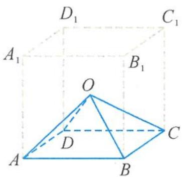

> [!faq]- 《浙大优辅《高中数学新体系 立体几何的秘密》》例题解析
>
> > [!success]- **【答案】** 详见解析
>
> > [!note]- **【分析】**
> > 本题未单列分析。
>
> > [!note]- **【解析】**
> > 解答 6个这样全等的正四棱锥可以拼成一个大的正方体(四棱锥的底面分别为正方体的面, 四棱锥顶点是正方体的中心 O, 如图 3.2-7), 以 O 为球心、1 为半径作一个球, 这个球是大正方体的内切球.
> > 
> > 图3.2-7
> > 所以球与一个正四棱锥的公共部分的体积为球体积的 $\frac{1}{6}$ , 故重叠部分的体积为
> > $$
> > \frac {1}{6} \times \left(\frac {4}{3} \pi \times 1 ^ {3}\right) = \frac {2}{9} \pi .
> > $$
> > 点评 我们解题的困难在于判断重叠部分几何体是什么样的图形,如何求其体积.这样的问题对我们来讲有点茫然,甚至是让人一筹莫展,无从下手,很难找到解题的突破口.其实,题目中隐藏着一些重要的数据1和 $\sqrt{3}$ ,这给我们指明了“借形”的方向,利用“借形”往往能助我们一臂之力也.
