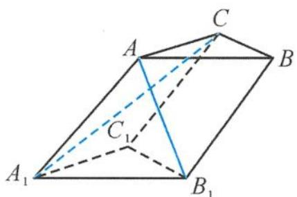
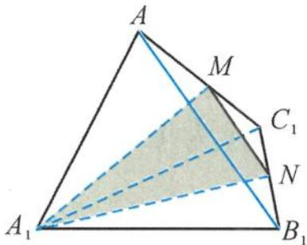

> [!faq]- 《浙大优辅《高中数学新体系 立体几何的秘密》》例题解析
>
> > [!success]- **【答案】** 详见解析
>
> > [!note]- **【分析】**
> > 本题未单列分析。
>
> > [!note]- **【解析】**
> > 
> > 图3.2-8
> > 
> > 图3.2-9
> > 解答 如图 3.2-9, 由题意易知 $A-A_{1}B_{1}C_{1}$ 为正四面体, 分别取 $AC_{1}, B_{1}C_{1}$ 的中点 M, N, 则
> > $$
> > \overrightarrow {A _ {1} M} = \frac {1}{2} \overrightarrow {A _ {1} C}.
> > $$
> > 连接 $MN$ , 则 $MN \parallel AB_{1}$ , 所以 $\angle A_{1}MN$ 为异面直线 $A_{1}C$ 与 $AB_{1}$ 所成的角或补角. 在 $\triangle A_{1}MN$ 中, 求得
> > $$
> > \cos \angle A _ {1} M N = \frac {\sqrt {3}}{6}.
> > $$
