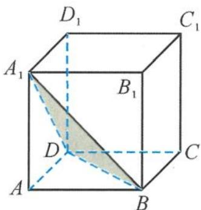

> [!faq]- 《浙大优辅《高中数学新体系 立体几何的秘密》》例题解析
>
> > [!success]- **【答案】** C
>
> > [!note]- **【分析】**
> > 本题未单列分析。
>
> > [!note]- **【解析】**
> > 
> > 解答 设 $BD_{1}$ 的中点为 $O$ , 则正方体 $ABCD-A_{1}B_{1}C_{1}D_{1}$ 的内切球是以 $O$ 为球心、 $\frac{1}{2}$ 为半径的球.
> > 图3.2-10
> > 另外, 点 $N$ 在正方体 $ABCD-A_{1}B_{1}C_{1}D_{1}$ 的外接球的一个小圆上运动, 小圆为 $\triangle A_{1}BD$ 的外
> > 接圆,而正方体的外接球的半径为 $\frac{\sqrt{3}}{2}$ ,也以O为球心.
> > 因此, 原问题就转化为求两个同心球上两个点 M 与 N 之间的最短距离. 所以线段 MN 的最小值是正方体外接球的半径减去正方体内切球的半径.
> > 答案选C.
> > 点评 本题的解题困难之处是点 N 的运动轨迹与正方体的内切球之间的关系不够明确,但借用外接球就把这层朦胧关系给捅破了.原问题转化为两个同心球的问题,这样问题便迎刃而解.
> > 引申1 在棱长为1的正方体 $ABCD - A_{1}B_{1}C_{1}D_{1}$ 中, 已知点 $M$ 在与正方体的各条棱都相切的球面上运动, 点 $N$ 在 $\triangle ACB_{1}$ 的外接圆上运动, 则线段 $MN$ 长度的最小值是 ( ). A. $\frac{\sqrt{3}-1}{2}$ B. $\frac{\sqrt{2}-1}{2}$ C. $\frac{\sqrt{3}-\sqrt{2}}{2}$ D. $\sqrt{3}-\sqrt{2}$
> > 解答 设 $BD_{1}$ 的中点为 $O$ , 则点 $M$ 在以 $O$ 为球心、 $\frac{\sqrt{2}}{2}$ 为半径的球面上运动.
> > 另外, 正方体 $ABCD-A_{1}B_{1}C_{1}D_{1}$ 的外接球是以 $O$ 为球心、 $\frac{\sqrt{3}}{2}$ 为半径的球. 点 $N$ 在正方体 $ABCD-A_{1}B_{1}C_{1}D_{1}$ 的外接球的一个小圆上运动.
> > 因此, 原问题就转化为求两个同心球上两个点 M 与 N 之间的最短距离, 所以线段 MN 的最小值是 $\frac{\sqrt{3}-\sqrt{2}}{2}$ .
> > 故选 C.
> > 引申 2 在空间直角坐标系 Oxyz 中, 已知棱长为 2 的正四面体 ABCD 的顶点 A, B 分别在 x 轴、y 轴上移动, 则棱 CD 的中点 M 到点 O 的距离 d 的取值范围是 \_\_\_\_.
> > 解答 记 $AB$ 的中点为 $N$ , 则
> > $$
> > O N = 1, M N = \sqrt {2}.
> > $$
> > 利用运动的相对性,可以考虑让正四面体 ABCD 不动,那么点 O 就在以 AB 为直径的球面上运动,所以
> > $$
> > \mid M N \mid - 1 \leqslant d \leqslant \mid M N \mid + 1.
> > $$
> > 故 $OM \in [\sqrt{2} - 1, \sqrt{2} + 1]$ .
