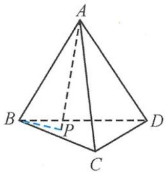
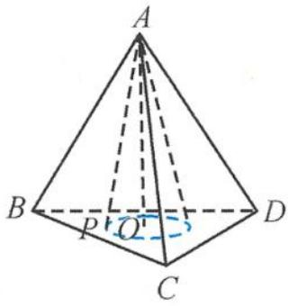

> [!faq]- 《浙大优辅《高中数学新体系 立体几何的秘密》》例题解析
>
> > [!success]- **【答案】** 详见解析
>
> > [!note]- **【分析】**
> > 本题未单列分析。
>
> > [!note]- **【解析】**
> > 
> > 图3.2-11
> > 
> > 图3.2-12
> > 解答 如图 3.2-12, 过顶点 A 作底面 BCD 的垂线, 垂足为 O, 则
> > $$
> > A O = \sqrt {6},
> > $$
> > 所以
> > $$
> > O P = \sqrt {2},
> > $$
> > 即点 $P$ 在以 $O$ 为圆心， $\sqrt{2}$ 为半径的圆上运动，因此 $|BP|$ 的最小值是
> > $$
> > \mid O B \mid - \sqrt {2} = \sqrt {3} - \sqrt {2}.
> > $$
> > 另外, 直线 $AP$ 可以看作是以 $AO$ 为轴的圆锥的母线, 直线 $BC$ 看作圆锥底面内的一条直线,由最小角定理知, 直线 $AP$ 与直线 $BC$ 所成角的最小角是直线 $AP$ 与圆锥底面所成的角, 为 $\frac{\pi}{3}$ .
> > 故直线 AP 与直线 BC 所成角的取值范围是 $\left[\frac{\pi}{3}, \frac{\pi}{2}\right]$ .
