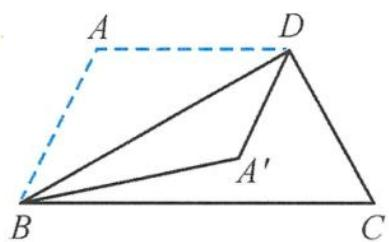
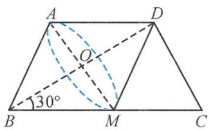

> [!faq]- 《浙大优辅《高中数学新体系 立体几何的秘密》》例题解析
>
> > [!success]- **【答案】** A
>
> > [!note]- **【分析】**
> > 本题未单列分析。
>
> > [!note]- **【解析】**
> > 
> > 图3.2-13
> > 
> > 图3.2-14
> > 解答 由题意,取 BC 的中点 M, 连接 AM, 易得四边形 AMCD 是平行四边形, 所以 AM = DC = AB.
> > 所以 $\triangle ABM$ 是等边三角形, 则
> > $$
> > \angle A B C = 6 0 ^ {\circ}, \angle A B D = 3 0 ^ {\circ}, \angle A ^ {\prime} B D = 3 0 ^ {\circ}, C D \perp B D.
> > $$
> > 在翻折过程中, $BA'$ 绕着 BD 旋转, $BA'$ 可以看成以 B 为顶点、BD 为轴的圆锥的母线, CD 为圆锥底面内的直线. 将原问题转化为求圆锥(图 3.2-14) 中母线与底面直线所成角的取值范围.
> > 其中母线与轴的夹角为 $30^{\circ}$ , 所以母线与底面直线所成角的取值范围是 $\left[\frac{\pi}{3}, \frac{\pi}{2}\right]$ . 故选 A.
> > 引申 已知正方体 $ABCD-A_{1}B_{1}C_{1}D_{1}$ ，若直线 l 与 $CC_{1}$ 所成的角为 $40^{\circ}$ ，则直线 l 与平面 $BB_{1}D_{1}D$ 所成的角有可能取到的是（）.
> > A. $30^{\circ}$ B. $45^{\circ}$ C. $60^{\circ}$ D. $75^{\circ}$
> > 解答 由题意, $\overrightarrow{AC}$ 为平面 $BB_{1}D_{1}D$ 的法向量.因为直线l与 $CC_{1}$ 所成的角为 $40^{\circ}$ ,所以直线l在以 $CC_{1}$ 为轴,半顶角为 $40^{\circ}$ 的圆锥曲面上,直线AC在圆锥的底面上.
> > 由最小角定理知, 直线 $l$ 与直线 $A C$ 所成的最小角为线面角, 为 $50^{\circ}$ , 所以直线 $l$ 与平面 $B B_{1} D_{1} D$ 所成角的最大角为 $40^{\circ}$ .
> >
> > 故选 **A**.
