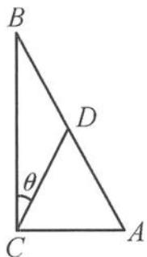
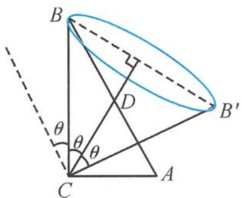
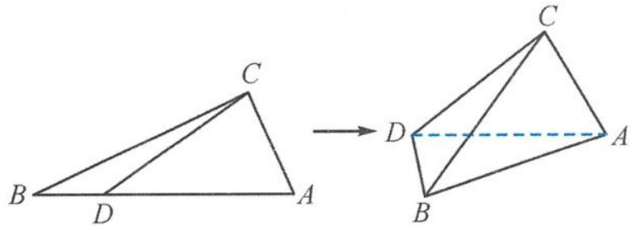
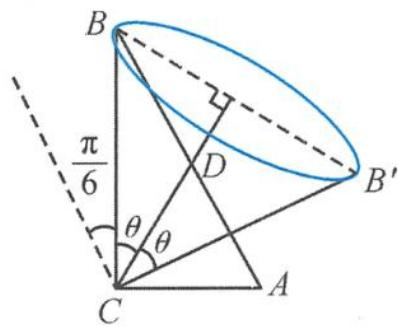
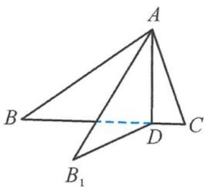
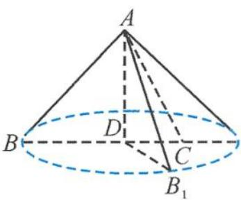

> [!faq]- 《浙大优辅《高中数学新体系 立体几何的秘密》》例题解析
>
> > [!success]- **【答案】** C
>
> > [!note]- **【分析】**
> > 本题未单列分析。
>
> > [!note]- **【解析】**
> > 
> > 图3.2-15
> > 
> > 图3.2-16
> > 解答 设 $\angle BCD = \theta$ , 在翻折过程中, $CB$ 与 $AD$ 所成的最大角为 $3\theta$ , 如图 3.2-16. 因为要存在某个位置, 使得 $CB \perp AD$ , 须满足
> > $$
> > 3 \theta \geqslant \frac {\pi}{2},
> > $$
> > 即 $\theta \geqslant \frac{\pi}{6}$ , 所以
> > $$
> > \tan \theta = \frac {1}{x} \geqslant \frac {\sqrt {3}}{3}.
> > $$
> > 故选A.
> > 引申 1 如图 3.2-17, 在 Rt△ABC 中, 已知 AC = 1, BC = √3, D 是斜边 AB 上的动点, 设 BD = x, 将 △BCD 沿直线 CD 翻折. 若在翻折过程中存在某个位置, 使得 BC 与 AD 所成的角为 $\frac{\pi}{3}$ , 则 x 的取值范围是 ( ).
> > A. $0 <   x <   \frac{3 - \sqrt{3}}{2}$ B. $\frac{3 - \sqrt{3}}{2} <  x <   2$ C. $0 <   x <   \frac{2 - \sqrt{3}}{2}$ D. $\frac{2 - \sqrt{3}}{2} <  x <   2$
> > 
> > 图3.2-17
> > 解答 设 $\angle BCD = \theta$ , 易知 $BC$ 与 $AD$ 所成的最大角为 $2\theta + \frac{\pi}{6}$ (图3.2-18), 若满足在翻折过程中存在某个位置, 使得 $BC$ 与 $AD$ 所成的角为 $\frac{\pi}{3}$ , 则
> > $$
> > 2 \theta + \frac {\pi}{6} > \frac {\pi}{3},
> > $$
> > 解得 $\theta >\frac{\pi}{12}$ .在 $\triangle BDC$ 中，
> > 
> > $$
> > \frac {x}{\sin \theta} = \frac {\sqrt {3}}{\sin \left(\frac {5}{6} \pi - \theta\right)},
> > $$
> > 图3.2-18
> > 所以 $\frac{\sqrt{3}}{x} = \frac{1}{2\tan\theta} +\frac{\sqrt{3}}{2}$ ，解得
> > $$
> > \frac {3 - \sqrt {3}}{2} <   x <   2.
> > $$
> > 故选 B.
> > 引申 2 如图 3.2-19, 在 $\triangle ABC$ 中, 已知 $AD \perp BC$ , 将 $\triangle ABD$ 沿 $AD$ 翻折, 若存在某个位置使 $AB_{1} \perp AB$ , 则下列成立的是 ( ).
> > A. $AB \geqslant AC$ B. $AD \geqslant CD$ C. $BD \geqslant AD$ D. $BD \geqslant CD$
> > 
> > 图3.2-19
> > 
> > 图3.2-20
> > 解答 由题意知,在 $\triangle ABD$ 沿 $AD$ 翻折的过程中, $AB_{1}$ 可以看作以 $AD$ 为轴的圆锥的一条母线(图3.2-20).要满足 $AB_{1} \perp AB$ ,则圆锥轴截面的顶角不能小于 $90^{\circ}$ ,则 $\angle BAD \geqslant 45^{\circ}$ , 所以 $BD \geqslant AD$ .故选C.
> > 立体几何承载了培养学生空间想象能力的功能,如何把这个高大上的核心素养落地呢?通过借助一些重要的几何模型,直观感知,归纳总结,最终形成自己的空间想象能力,这是一种不错的选择.
