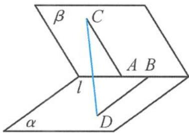
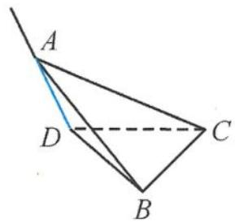

> [!faq]- 《浙大优辅《高中数学新体系 立体几何的秘密》》例题解析
>
> > [!success]- **【答案】** A
>
> > [!note]- **【分析】**
> > 本题未单列分析。
>
> > [!note]- **【解析】**
> > 
> > 图3.3-1
> > 解答 因为 $\overrightarrow{CD} = \overrightarrow{CA} +\overrightarrow{AB} +\overrightarrow{BD}$ ，所以
> > $$
> > \begin{array}{r l} \vert \overrightarrow {C D} \vert^ {2} & = (\overrightarrow {C A} + \overrightarrow {A B} + \overrightarrow {B D}) ^ {2} \\ & = \vert \overrightarrow {C A} \vert^ {2} + \vert \overrightarrow {A B} \vert^ {2} + \vert \overrightarrow {B D} \vert^ {2} + 2 (\overrightarrow {C A} \cdot \overrightarrow {A B} + \overrightarrow {A B} \cdot \overrightarrow {B D} + \overrightarrow {C A} \cdot \overrightarrow {B D}) \\ & = m ^ {2} + d ^ {2} + n ^ {2} + 2 (0 + 0 - m n \cos \theta) \\ & = m ^ {2} + d ^ {2} + n ^ {2} - 2 m n \cos \theta . \end{array}
> > $$
> > 故选A.
> > 引申 1 在矩形 ABCD 中, 已知 $AB = \sqrt{3}$ , AD = 1, 现将 $\triangle ACD$ 沿对角线 AC 向上翻折, 若翻折过程中 BD 的长度在范围 $\left[\frac{\sqrt{7}}{2}, \frac{\sqrt{13}}{2}\right]$ 内变化, 则点 D 的运动轨迹的长度是 \_\_\_\_.
> > 解答 在矩形ABCD中, 过点B作AC的垂线, 垂足为E, 过点D作AC的垂线, 垂足为F, 则点D的运动轨迹是以F为圆心、 $DF=\frac{\sqrt{3}}{2}$ 为半径的圆.
> > 设二面角 $D - AC - B$ 的大小为 $\theta$ ，因为 $\overrightarrow{BD} = \overrightarrow{BE} +\overrightarrow{EF} +\overrightarrow{FD}$ ，所以
> > $$
> > \begin{array}{r l} & {| \overrightarrow {B D} | ^ {2} = (\overrightarrow {B E} + \overrightarrow {E F} + \overrightarrow {F D}) ^ {2}} \\ & {\quad = | \overrightarrow {B E} | ^ {2} + | \overrightarrow {E F} | ^ {2} + | \overrightarrow {F D} | ^ {2} + 2 (\overrightarrow {B E} \cdot \overrightarrow {E F} + \overrightarrow {E F} \cdot \overrightarrow {F D} + \overrightarrow {B E} \cdot \overrightarrow {F D})} \\ & {\quad = \frac {5}{2} - \frac {3}{2} \cos \theta \in \left[ \frac {7}{4}, \frac {1 3}{4} \right],} \end{array}
> > $$
> > 得到
> > $$
> > \cos \theta \in \left[ - \frac {1}{2}, \frac {1}{2} \right],
> > $$
> > 所以 $\theta \in \left[\frac{\pi}{3},\frac{2\pi}{3}\right]$ ，因此点 $D$ 的运动轨迹的长度是
> > $$
> > \frac {\sqrt {3}}{2} \left(\frac {2 \pi}{3} - \frac {\pi}{3}\right) = \frac {\sqrt {3}}{6} \pi .
> > $$
> > 引申 2 如图 3.3-2, 在二面角 A-CD-B 中, BC ⊥ CD, BC = CD = 2, 点 A 在直线 AD 上运动, 满足 AD ⊥ CD, AB = 3, 现将平面 ADC 沿着 CD 进行翻折, 在翻折的过程中, 线段 AD 长的取值范围是 \_\_\_\_.
> > 
> > 解答 设 AD = x, 二面角 A-CD-B 的平面角为 $\theta$ , 则
> > 图3.3-2
> > $$
> > \langle \overrightarrow {D A}, \overrightarrow {C B} \rangle = \theta .
> > $$
> > 因为 $\overrightarrow{AB} = \overrightarrow{AD} +\overrightarrow{DC} +\overrightarrow{CB}$ ，所以
> > $$
> > \begin{array}{r l} \left| \overrightarrow {A B} \right| ^ {2} & = (\overrightarrow {A D} + \overrightarrow {D C} + \overrightarrow {C B}) ^ {2} \\ & = \left| \overrightarrow {A D} \right| ^ {2} + \left| \overrightarrow {D C} \right| ^ {2} + \left| \overrightarrow {C B} \right| ^ {2} + 2 (\overrightarrow {A D} \cdot \overrightarrow {D C} + \overrightarrow {A D} \cdot \overrightarrow {C B} + \overrightarrow {D C} \cdot \overrightarrow {C B}), \end{array}
> > $$
> > 所以
> > $$
> > \cos \theta = \frac {x ^ {2} - 1}{4 x},
> > $$
> > 即
> > $$
> > \left| \frac {x ^ {2} - 1}{4 x} \right| \leqslant 1,
> > $$
> > 因此 $x \in [\sqrt{5} - 2, \sqrt{5} + 2]$ ，即线段 AD 长的取值范围是 $[\sqrt{5} - 2, \sqrt{5} + 2]$ .
