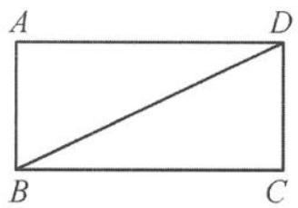
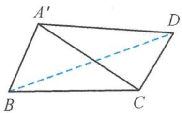
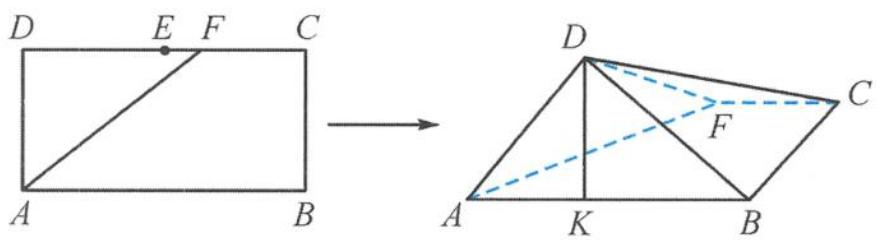

> [!faq]- 《浙大优辅《高中数学新体系 立体几何的秘密》》例题解析
>
> > [!success]- **【答案】** B
>
> > [!note]- **【分析】**
> > 本题未单列分析。
>
> > [!note]- **【解析】**
> > 
> > 图3.3-3
> > 
> > 图3.3-4
> > 解答 如图 3.3-4, 在翻折过程中, 易求得
> > $$
> > \frac {\sqrt {3}}{3} \leqslant | \overrightarrow {A C} | \leqslant \sqrt {3},
> > $$
> > 在两个临界点取等号. 因为
> > $$
> > \overrightarrow {A C} \cdot \overrightarrow {B D} = \frac {| \overrightarrow {A D} | ^ {2} + | \overrightarrow {B C} | ^ {2} - | \overrightarrow {A B} | ^ {2} - | \overrightarrow {C D} | ^ {2}}{2} = 1,
> > $$
> > 所以直线 AC 与直线 BD 不垂直. 而
> > $$
> > \overrightarrow {A B} \cdot \overrightarrow {C D} = \frac {| \overrightarrow {A D} | ^ {2} + | \overrightarrow {B C} | ^ {2} - | \overrightarrow {A C} | ^ {2} - | \overrightarrow {B D} | ^ {2}}{2} = \frac {1 - | \overrightarrow {A C} | ^ {2}}{2},
> > $$
> > 当 $|\overrightarrow{AC}| = 1$ 时，直线 $AB$ 与直线 $CD$ 垂直.故选B.
> > 引申 如图3.3-5, 在长方形ABCD中, 已知 $AB = 2$ , $BC = 1$ , $E$ 为 $DC$ 的中点, $F$ 为线段EC(端点除外)上的动点. 现将 $\triangle AFD$ 沿AF折起, 使平面ABD⊥平面ABC. 在平面ABD内过点D作DK⊥AB, K为垂足. 设AK = t, 则t的取值范围是
> > 
> > 图3.3-5
> > 解答 因为平面 $ABD \perp$ 平面 $ABC$ , 且 $DK \perp AB$ , 所以 $DK \perp$ 平面 $ABC$ , 得
> > $$
> > D K \perp A F.
> > $$
> > 从而 $\overrightarrow{DK} \cdot \overrightarrow{AF} = \frac{|\overrightarrow{DF}|^2 + |\overrightarrow{KA}|^2 - |\overrightarrow{AD}|^2 - |\overrightarrow{KF}|^2}{2} = 0$ ，即 $|\overrightarrow{DF}|^2 + |\overrightarrow{KA}|^2 = |\overrightarrow{AD}|^2 + |\overrightarrow{KF}|^2$ .
> > 设 $DF = x(1 < x < 2)$ ，则
> > $$
> > x ^ {2} + t ^ {2} = 1 ^ {2} + (x - t) ^ {2} + 1 ^ {2},
> > $$
> > 所以 $t = \frac{1}{x}\in \left(\frac{1}{2},1\right)$ .故
> > $$
> > t \in \left(\frac {1}{2}, 1\right).
> > $$
> > ## (2) 角或角的范围求解问题
