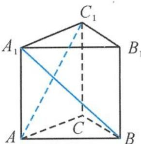
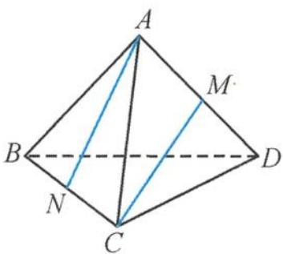

> [!faq]- 《浙大优辅《高中数学新体系 立体几何的秘密》》例题解析
>
> > [!success]- **【答案】** D
>
> > [!note]- **【分析】**
> > 本题未单列分析。
>
> > [!note]- **【解析】**
> > 
> > 图3.3-6
> > 解答 因为
> > $$
> > \overrightarrow {A _ {1} B} \cdot \overrightarrow {A C _ {1}} = \frac {\left| \overrightarrow {A _ {1} C _ {1}} \right| ^ {2} + \left| \overrightarrow {A B} \right| ^ {2} - \left| \overrightarrow {A A _ {1}} \right| ^ {2} - \left| \overrightarrow {B C _ {1}} \right| ^ {2}}{2} = 0,
> > $$
> > 所以
> > $$
> > \overrightarrow {A _ {1} B} \perp \overrightarrow {A C _ {1}}.
> > $$
> > 即异面直线 $A_{1}B, AC_{1}$ 所成角的大小为 $\frac{\pi}{2}$ . 故选 D.
> > 引申 1 如图 3.3-7, 在三棱锥 A-BCD 中, 已知 AB = AC = BD = CD = 3, AD = BC = 2, M, N 分别为 AD, BC 的中点, 则异面直线 AN, CM 所成角的余弦值是 \_\_\_\_.
> > 解答 因为 $|\overrightarrow{AN}| = |\overrightarrow{CM}| = 2\sqrt{2}, |\overrightarrow{MN}| = \sqrt{7}$ , 所以
> > 
> > 图3.3-7
> > $$
> > \overrightarrow {A N} \cdot \overrightarrow {C M} = \frac {\left| \overrightarrow {A M} \right| ^ {2} + \left| \overrightarrow {N C} \right| ^ {2} - \left| \overrightarrow {A C} \right| ^ {2} - \left| \overrightarrow {M N} \right| ^ {2}}{2} = - 7,
> > $$
> > 所以
> > $$
> > \cos \langle \overrightarrow {A N}, \overrightarrow {C M} \rangle = - \frac {7}{8}.
> > $$
> > 因此, 异面直线 AN, CM 所成角的余弦值是 $\frac{7}{8}$ .
