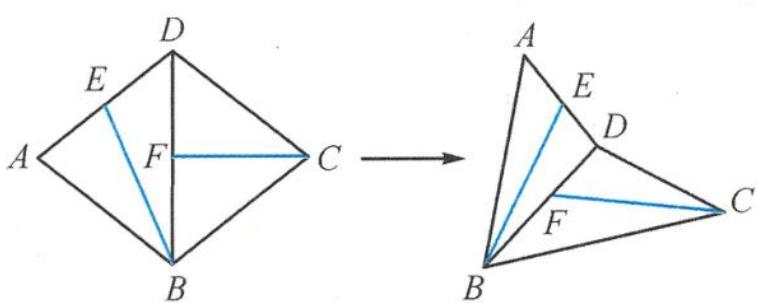
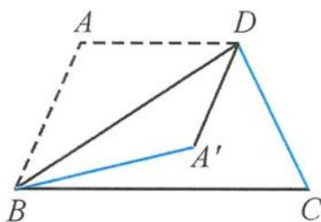
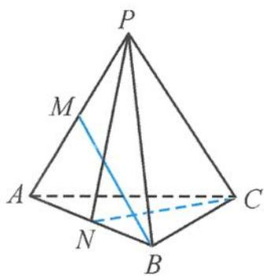
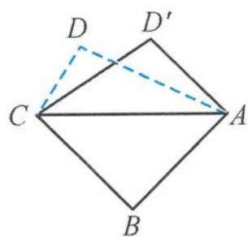

> [!faq]- 《浙大优辅《高中数学新体系 立体几何的秘密》》例题解析
>
> > [!success]- **【答案】** A
>
> > [!note]- **【分析】**
> > 本题未单列分析。
>
> > [!note]- **【解析】**
> > 
> > 图3.3-8
> > 解答 设 AB = 2, 则
> > $$
> > \overrightarrow {B E} \cdot \overrightarrow {C F} = \frac {| \overrightarrow {B F} | ^ {2} + | \overrightarrow {E C} | ^ {2} - | \overrightarrow {B C} | ^ {2} - | \overrightarrow {E F} | ^ {2}}{2} = \frac {| \overrightarrow {E C} | ^ {2}}{2} - 2.
> > $$
> > 因为 $1 < |\overrightarrow{EC}| < \sqrt{7}$ , 所以
> > $$
> > \cos \langle \overrightarrow {B E}, \overrightarrow {F C} \rangle \in \left(- \frac {1}{2}, \frac {1}{2}\right).
> > $$
> > 所以异面直线 BE 与 CF 所成角的取值范围是 $\left(\frac{\pi}{3}, \frac{\pi}{2}\right]$ . 故选 C.
> > 引申 1 如图 3.3-9, 在等腰梯形 $ABCD$ 中, 已知 $AB = AD = CD = 1$ , $BC = 2$ , 将 $\triangle ABD$ 沿直线 $BD$ 翻折成 $\triangle A'BD$ , 则直线 $BA'$ 与 $CD$ 所成角的取值范围是 ( ).
> > A. $\left[\frac{\pi}{3}, \frac{\pi}{2}\right]$ B. $\left[\frac{\pi}{6}, \frac{\pi}{3}\right]$ C. $\left[\frac{\pi}{6}, \frac{\pi}{2}\right]$ D. $\left[0, \frac{\pi}{3}\right]$
> > 
> > 图3.3-9
> > 解答 由题意得
> > $$
> > \overrightarrow {B A ^ {\prime}} \cdot \overrightarrow {C D} = \frac {| \overrightarrow {B D} | ^ {2} + | \overrightarrow {A ^ {\prime} C} | ^ {2} - | \overrightarrow {B C} | ^ {2} - | \overrightarrow {A ^ {\prime} D} | ^ {2}}{2} = \frac {| \overrightarrow {A ^ {\prime} C} | ^ {2}}{2} - 1.
> > $$
> > 因为 $1 \leqslant |\overrightarrow{A'C}| \leqslant \sqrt{3}$ ,
> > $$
> > \cos \langle \overrightarrow {B A ^ {\prime}}, \overrightarrow {C D} \rangle = \frac {\overrightarrow {B A ^ {\prime}} \cdot \overrightarrow {C D}}{| \overrightarrow {B A ^ {\prime}} | | \overrightarrow {C D} |} \in \left[ - \frac {1}{2}, \frac {1}{2} \right],
> > $$
> > 所以直线 $BA'$ 与 CD 所成角的取值范围是 $\left[\frac{\pi}{3}, \frac{\pi}{2}\right]$ . 故选 A.
> > 引申 2 如图 3.3-10, 在三棱锥 $P - ABC$ 中, 已知 $PA = PB = AB = AC = BC$ , $M$ 为 $PA$ 的中点, $N$ 为 $AB$ 的中点. 当二面角 $P - AB - C$ 的大小为 $\frac{\pi}{3}$ 时, 直线 $BM$ 与 $CN$ 所成角的余弦值为 \_\_\_\_.
> > 
> > 解答 设 $PA = PB = AB = AC = BC = 2$ ，则 $BM = CN = \sqrt{3}$ 。因为 $PN \perp AB, CN \perp AB$ ，所以 $\angle PNC$ 为二面角 $P - AB - C$ 的平面角，得 $\angle PNC = \frac{\pi}{3}$ ，从而 $PC = \sqrt{3}$ 。又因为
> > 图3.3-10
> > $$
> > 4 \left| \overrightarrow {C M} \right| ^ {2} + \left| \overrightarrow {P A} \right| ^ {2} = 2 (\left| \overrightarrow {C A} \right| ^ {2} + \left| \overrightarrow {C P} \right| ^ {2}),
> > $$
> > 所以 $|\overrightarrow{CM}|^2 = \frac{5}{2}$ . 由向量的对角线定理得
> > $$
> > \overrightarrow {B M} \cdot \overrightarrow {C N} = \frac {| \overrightarrow {B N} | ^ {2} + | \overrightarrow {C M} | ^ {2} - | \overrightarrow {B C} | ^ {2} - | \overrightarrow {M N} | ^ {2}}{2} = - \frac {3}{4}.
> > $$
> > 从而
> > $$
> > \cos \langle \overrightarrow {B M}, \overrightarrow {C N} \rangle = - \frac {1}{4},
> > $$
> > 所以直线 BM 与 CN 所成角的余弦值为 $\frac{1}{4}$ .
> > 引申 3 如图 3.3-11, 在平面四边形 ABCD 中, 已知 AB = BC = 3, CD = 1, $AD = \sqrt{5}$ , $\angle ADC = 90^{\circ}$ . 沿直线 AC 将 $\triangle ACD$ 翻折成 $\triangle ACD'$ , 直线 AC 与 $BD'$ 所成角的余弦的最大值是 \_\_\_\_.
> > 解答 设 $\langle\overrightarrow{AC},\overrightarrow{BD^{\prime}}\rangle=\theta$ , 因为
> > 
> > 图3.3-11
> > $$
> > \overrightarrow {A C} \cdot \overrightarrow {B D ^ {\prime}} = \frac {| \overrightarrow {A D ^ {\prime}} | ^ {2} + | \overrightarrow {B C} | ^ {2} - | \overrightarrow {A B} | ^ {2} - | \overrightarrow {C D ^ {\prime}} | ^ {2}}{2} = 2,
> > $$
> > 所以
> > $$
> > \sqrt {6} \mid \overrightarrow {B D ^ {\prime}} \mid \cos \theta = 2.
> > $$
> > 又 $\cos \angle ACD = \cos \angle ACB$ ，所以
> > $$
> > \mid B D ^ {\prime} \mid_ {\min} = \mid B C \mid - \mid C D \mid = 2,
> > $$
> > 所以
> > $$
> > (\cos \theta) _ {\max} = \frac {\sqrt {6}}{6}.
> > $$
