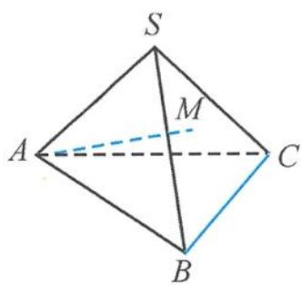
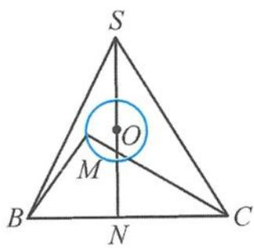
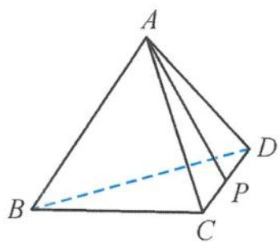
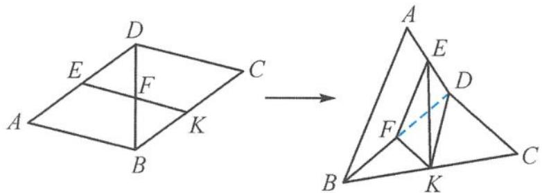

> [!faq]- 《浙大优辅《高中数学新体系 立体几何的秘密》》例题解析
>
> > [!success]- **【答案】** D
>
> > [!note]- **【分析】**
> > 本题未单列分析。
>
> > [!note]- **【解析】**
> > 
> > 解答 取 BC 的中点 N，连接 AN, SN. 因为 AB = AC = SB = SC = 5, SA = 4, BC = 6，所以 BC ⊥ AN, BC ⊥ SN，得 BC ⊥ 平面 SAN，且 $\triangle SAN$ 为正三角形（边长都为 4），
> > 图3.3-12
> > 过点 $A$ 作 $SN$ 的垂线, 垂足为 $O$ , 则 $O$ 为 $SN$ 的中点, 且 $AO = 2\sqrt{3}$ , 而 $AM = \sqrt{13}$ , 所以 $OM = 1$ , 即点 $M$ 在以 $O$ 圆心、1 为半径的圆上运动, 如图 3.3-13. 所以
> > $$
> > \begin{array}{r l} \cos \alpha & = | \cos \langle \overrightarrow {A M}, \overrightarrow {B C} \rangle | \\ & = \frac {| | \overrightarrow {A C} | ^ {2} + | \overrightarrow {B M} | ^ {2} - | \overrightarrow {A B} | ^ {2} - | \overrightarrow {C M} | ^ {2} |}{2 | \overrightarrow {A M} | | \overrightarrow {B C} |} \\ & = \frac {| | \overrightarrow {B M} | ^ {2} - | \overrightarrow {C M} | ^ {2} |}{2 | \overrightarrow {A M} | | \overrightarrow {B C} |} \\ & = \frac {| (\overrightarrow {M B} - \overrightarrow {M C}) \cdot (\overrightarrow {M B} + \overrightarrow {M C}) |}{2 | \overrightarrow {A M} | | \overrightarrow {B C} |} \end{array}
> > $$
> > 
> > 图3.3-13
> > $= \frac{|\overrightarrow{CB}\cdot(2\overrightarrow{MN})|}{2|\overrightarrow{AM}||\overrightarrow{BC}|}$ $= \frac{|\overrightarrow{CB}\cdot\overrightarrow{MN}|}{6\sqrt{13}}\leqslant \frac{\sqrt{13}}{13}.$ （利用投影）
> > 引申1 如图3.3-14,在正四面体A-BCD中,P是棱CD上的动点,设 $CP=tCD,t\in(0,1)$ ,记AP与BC,BD所成的角分别为 $\alpha,\beta$ ,则().A. $\alpha\geqslant\beta$ B.当 $t\in\left(0,\frac{1}{2}\right]$ 时, $\alpha\geqslant\beta$ C. $\alpha\leqslant\beta$ D.当 $t\in\left(0,\frac{1}{2}\right]$ 时, $\alpha\leqslant\beta$
> > 
> > 图3.3-14
> > 解答 设正四面体的棱长为 1, 则 CP = t, PD = 1 - t,
> > $$
> > \cos \alpha = \frac {| \overrightarrow {A C} | ^ {2} + | \overrightarrow {P B} | ^ {2} - | \overrightarrow {A B} | ^ {2} - | \overrightarrow {P C} | ^ {2}}{2 | \overrightarrow {A P} | | \overrightarrow {B C} |} = \frac {| \overrightarrow {P B} | ^ {2} - | \overrightarrow {P C} | ^ {2}}{2 | \overrightarrow {A P} |},
> > $$
> > $$
> > \cos \beta = \frac {\left| \overrightarrow {A D} \right| ^ {2} + \left| \overrightarrow {P B} \right| ^ {2} - \left| \overrightarrow {A B} \right| ^ {2} - \left| \overrightarrow {P D} \right| ^ {2}}{2 \mid \overrightarrow {A P} \mid \mid \overrightarrow {B D} \mid} = \frac {\left| \overrightarrow {P B} \right| ^ {2} - \left| \overrightarrow {P D} \right| ^ {2}}{2 \mid \overrightarrow {A P} \mid},
> > $$
> > 所以
> > $$
> > \cos \alpha - \cos \beta = \frac {| \overrightarrow {P D} | ^ {2} - | \overrightarrow {P C} | ^ {2}}{2 | \overrightarrow {A P} |} = \frac {1 - 2 t}{2 | \overrightarrow {A P} |}.
> > $$
> > 又 $\alpha, \beta \in \left(0, \frac{\pi}{2}\right]$ , 故选 D.
> > 引申 2 如图 3.3-15, 在菱形 ABCD 中, $\angle BAD = 60^{\circ}$ , 线段 AD, BD, BC 的中点分别为 E, F, K, 将 $\triangle ABD$ 沿对角线 BD 翻折. 设二面角 A-BD-C 为 $\alpha$ , 则 $\angle EFK$ 与 $\alpha$ 的大小关系为 \_\_\_\_.
> > 
> > 图3.3-15
> > 解答 设 AB = 1, 则
> > $$
> > \begin{array}{r l} \cos \angle E F K & = \cos \langle \overrightarrow {B A}, \overrightarrow {D C} \rangle = \frac {| \overrightarrow {B C} | ^ {2} + | \overrightarrow {A D} | ^ {2} - | \overrightarrow {B D} | ^ {2} - | \overrightarrow {A C} | ^ {2}}{2 | \overrightarrow {B A} | | \overrightarrow {D C} |} = \frac {1 - | \overrightarrow {A C} | ^ {2}}{2}, \\ \cos \alpha & = \cos \langle \overrightarrow {F A}, \overrightarrow {F C} \rangle = \frac {| \overrightarrow {F A} | ^ {2} + | \overrightarrow {F C} | ^ {2} - | \overrightarrow {A C} | ^ {2}}{2 | \overrightarrow {F A} | | \overrightarrow {F C} |} = \frac {3 - 2 | \overrightarrow {A C} | ^ {2}}{3}, \end{array}
> > $$
> > 从而
> > $$
> > \cos \angle E F K - \cos \alpha = \frac {| \overrightarrow {A C} | ^ {2} - 3}{6}.
> > $$
> > 因为 $0 \leqslant |\overrightarrow{AC}| \leqslant \sqrt{3}$ , 所以
> > $$
> > \angle E F K \geqslant \alpha .
> > $$
> > 知识储备 向量对角线定理
> > $$
> > \overrightarrow {A C} \cdot \overrightarrow {B D} = \frac {| \overrightarrow {A D} | ^ {2} + | \overrightarrow {B C} | ^ {2} - | \overrightarrow {A B} | ^ {2} - | \overrightarrow {C D} | ^ {2}}{2}.
> > $$
> > 记忆方法: $\overrightarrow{AC} \cdot \overrightarrow{BD} = \frac{|\overrightarrow{外外}|^{2} + |\overrightarrow{内内}|^{2} - |\overrightarrow{外内}|^{2} - |\overrightarrow{内外}|^{2}}{2}$ . (其中“内”“外”指字母的位置)
> > 证明 $\overrightarrow{AC} \cdot \overrightarrow{BD} = \overrightarrow{AC} \cdot (\overrightarrow{AD} - \overrightarrow{AB}) = \overrightarrow{AC} \cdot \overrightarrow{AD} - \overrightarrow{AC} \cdot \overrightarrow{AB}$ $= \frac{|\overrightarrow{AC}|^2 + |\overrightarrow{AD}|^2 - (\overrightarrow{AC} - \overrightarrow{AD})^2}{2} - \frac{|\overrightarrow{AC}|^2 + |\overrightarrow{AB}|^2 - (\overrightarrow{AC} - \overrightarrow{AB})^2}{2}$ $= \frac{|\overrightarrow{AD}|^2 + |\overrightarrow{BC}|^2 - |\overrightarrow{AB}|^2 - |\overrightarrow{CD}|^2}{2}$ . 证毕.
