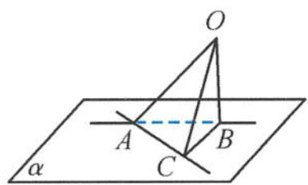

## 3.4.1 三余弦定理

如图3.4-1, 设 $A$ 为平面内一点, 过点 $A$ 的斜线 $AO$ 在平面上的射影为 $AB$ , $AC$ 为平面内的一条直线, 则 $\angle OAC, \angle BAC, \angle OAB$ 三个角 ( $\angle BAC$ 和 $\angle OAB$ 只能是锐角) 的余弦关系为

$$
\cos \angle O A C = \cos \angle B A C \cos \angle O A B.
$$

图3.4-1

通俗点说就是,平面 $\alpha$ 的一条斜线 l 与 $\alpha$ 所成的角为 $\theta_{1},\alpha$ 内的直线 m 与 l 在 $\alpha$ 上的射影 $l'$ 的夹角为 $\theta_{2},l$ 与 m 所成的角为 $\theta$ ,则 $\cos\theta=\cos\theta_{1}\cos\theta_{2}$ (又叫“爪子定理”).

![[高中/总复习/专题/高考数学秘密/浙大优辅《高中数学新体系 立体几何的秘密》/12_3_4_1_三余弦定理/questions/Q00035996.md]]
![[高中/总复习/专题/高考数学秘密/浙大优辅《高中数学新体系 立体几何的秘密》/12_3_4_1_三余弦定理/questions/Q00035997.md]]
![[高中/总复习/专题/高考数学秘密/浙大优辅《高中数学新体系 立体几何的秘密》/12_3_4_1_三余弦定理/questions/Q00035998.md]]
