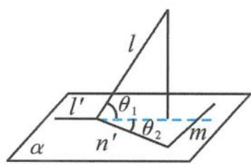

> [!faq]- 《浙大优辅《高中数学新体系 立体几何的秘密》》例题解析
>
> > [!success]- **【答案】** 详见解析
>
> > [!note]- **【分析】**
> > 本题未单列分析。
>
> > [!note]- **【解析】**
> > 解答 如图3.4-2, 设直线 $l$ 在平面 $\alpha$ 上的射影为 $l'$ , 则 $l' \subset \alpha$ . 又 $l \perp m$ , 由三垂线定理知 $l' \perp m$ , 且 $\cos \theta_1 = \frac{\sqrt{6}}{3}$ . 在平面 $\alpha$ 内作 $n' \parallel n$ , 设 $l$ 和 $n'$ 所成的角为 $\theta$ , 则 $\theta = \frac{\pi}{4}$ . 由三余弦定理得
> > 
> > 图3.4-2
> > $$
> > \cos \theta = \cos \theta_ {1} \cos \theta_ {2},
> > $$
> > 得 $\cos \theta_{2} = \frac{\sqrt{3}}{2}$ , 即
> > $$
> > \theta_ {2} = \frac {\pi}{6}.
> > $$
> > 所以 m 与 n 所成的角为 $\frac{\pi}{2} - \theta_{2} = \frac{\pi}{3}$ .
