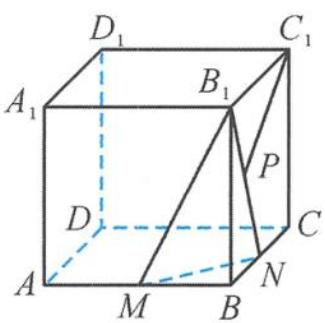
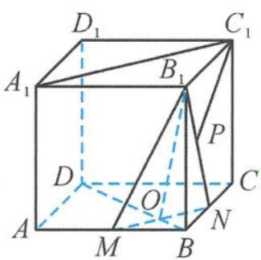

> [!faq]- 《浙大优辅《高中数学新体系 立体几何的秘密》》例题解析
>
> > [!success]- **【答案】** 详见解析
>
> > [!note]- **【分析】**
> > 本题未单列分析。
>
> > [!note]- **【解析】**
> > 
> > 图3.4-3
> > 
> > 图3.4-4
> > 解答 如图 3.4-4, 连接 BD, 设 $BD \cap MN = O$ , 易得 $MN \perp$ 平面 $BB_{1}D$ , 所以 $\angle BOB_{1}$ 是二面角 $B_{1}-MN-B$ 的平面角,
> > $$
> > \cos \angle B O B _ {1} = \frac {1}{3}.
> > $$
> > 连接 $A_{1}C_{1}$ ，则 $\angle A_{1}C_{1}P$ 为异面直线 $C_{1}P$ 与 MN 所成的角或其补角，由三余弦定理得到
> > $$
> > \cos \angle A _ {1} C _ {1} P = \cos \angle P C _ {1} B _ {1} \cos \angle A _ {1} C _ {1} B _ {1},
> > $$
> > 所以
> > $$
> > \cos \angle A _ {1} C _ {1} P = \frac {\sqrt {2}}{2} \cos \angle P C _ {1} B _ {1}.
> > $$
> > 而 $\cos \angle PC_{1}B_{1}\in \left(\frac{\sqrt{5}}{5},1\right)$ ，所以
> > $$
> > \cos \theta \in \left(\frac {\sqrt {1 0}}{1 0}, \frac {\sqrt {2}}{2}\right).
> > $$
> > 故答案为 $\frac{1}{3}$ ; $\left(\frac{\sqrt{10}}{10},\frac{\sqrt{2}}{2}\right)$ .
