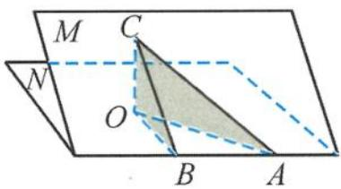

## 3.4.2 三正弦定理

设二面角 M-AB-N 的大小为 $\alpha$ ，在平面 M 内有一条射线 AC，它和棱 AB 所成的角为 $\beta$ ，和

平面 $N$ 所成的角为 $\gamma$ , 则 $\sin \gamma = \sin \alpha \sin \beta$ . (其中 $\alpha$ 是锐二面角的平面角)

证明 如图 3.4-7, 过点 C 作平面 N 的垂线, 垂足为 O, 则 $\angle CAO$ 为 AC 与平面 N 所成的角, 即 $\angle CAO = \gamma$ , 所以

图3.4-7

$$
\sin \gamma = \frac {O C}{A C}.
$$

在平面 M 中, 过点 C 作棱 AB 的垂线, 垂足为 B, 连接 OB, 则 OB ⊥ AB, ∠CBO 为二面角 M-AB-N 的平面角, 即 ∠CBO = α, 所以

$$
\sin \alpha = \frac {O C}{B C}.
$$

又 $\sin \beta = \frac{BC}{AC}$ , 因此

$$
\sin \gamma = \sin \alpha \sin \beta .
$$

证毕.

![[高中/总复习/专题/高考数学秘密/浙大优辅《高中数学新体系 立体几何的秘密》/13_3_4_2_三正弦定理/questions/Q00035999.md]]
