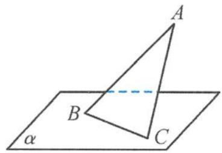
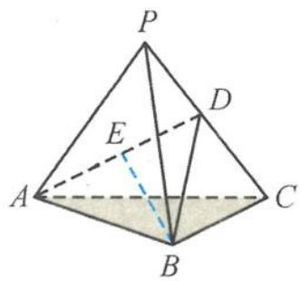

> [!faq]- 《浙大优辅《高中数学新体系 立体几何的秘密》》例题解析
>
> > [!success]- **【答案】** 详见解析
>
> > [!note]- **【分析】**
> > 本题未单列分析。
>
> > [!note]- **【解析】**
> > 
> > 图3.4-8
> > 解答 由三正弦定理得
> > $$
> > \sin \theta = \sin \angle A B C \sin \theta^ {\prime} = \sin \frac {\pi}{3} \sin \frac {\pi}{3} = \frac {3}{4}.
> > $$
> > 引申 如图 3.4-9, 已知棱长为 1 的正四面体 P-ABC, PC 的中点为 D, 动点 E 在线段 AD 上, 则直线 BE 与平面 ABC 所成角的正切值的取值范围是 \_\_\_\_.
> > 解答 设二面角 D-AB-C 的平面角为 $\alpha$ ，则
> > 
> > 图3.4-9
> > $$
> > \sin \alpha = \frac {\sqrt {3}}{3}.
> > $$
> > 设直线 BE 与平面 ABC 所成的角为 $\theta$ ，由三正弦定理知
> > $$
> > \sin \theta = \sin \angle A B E \sin \alpha = \frac {\sqrt {3}}{3} \sin \angle A B E.
> > $$
> > 又 $\sin \angle ABE\in \left[0,\frac{\sqrt{6}}{3}\right]$ ，所以
> > $$
> > \sin \theta \in \left[ 0, \frac {\sqrt {2}}{3} \right].
> > $$
> > 故直线 BE 与平面 ABC 所成角的正切值的取值范围是 $\left[0, \frac{\sqrt{14}}{7}\right]$ .
> > 点评 对于一些立体几何问题而言,若我们能恰到好处地利用好三正弦定理,则解题就能多一条思考的路径,可简化很多烦琐的运算,快速解出答案.
