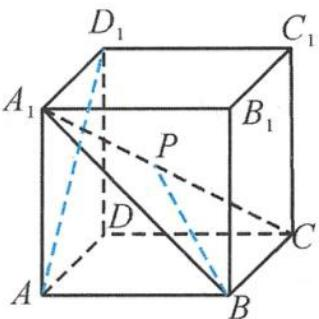
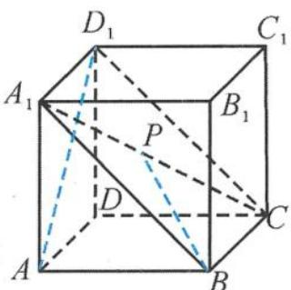
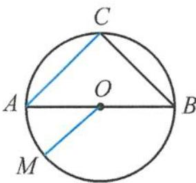
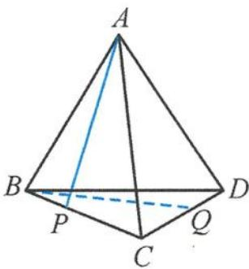
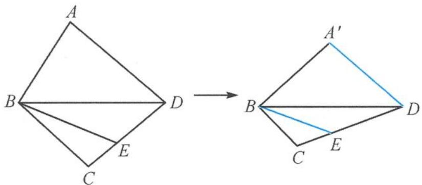
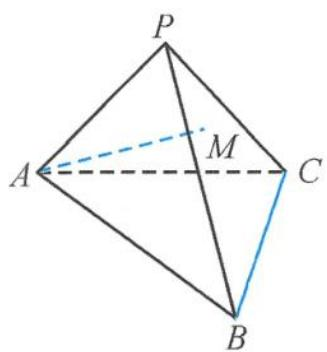

> [!faq]- 《浙大优辅《高中数学新体系 立体几何的秘密》》例题解析
>
> > [!success]- **【答案】** A
>
> > [!note]- **【分析】**
> > 本题未单列分析。
>
> > [!note]- **【解析】**
> > 
> > 图3.4-10
> > 
> > 图3.4-11
> > 解答 如图 3.4-11, 连接 $CD_{1}$ , 由最小角定理知, 直线 BP 与 $AD_{1}$ 所成角的最小角是 $AD_{1}$ 与平面 $A_{1}BCD_{1}$ 所成的角, 易求 $AD_{1}$ 与平面 $A_{1}BCD_{1}$ 所成的角为 $\frac{\pi}{6}$ ; 当点 P 在点 $A_{1}$ 时, 直线 BP 与 $AD_{1}$ 所成的角取到最大值 $\frac{\pi}{3}$ . 故选 D.
> > 引申1 如图3.4-12, 已知等腰直角三角形 $ABC$ 内接于圆 $O$ , 点 $M$ 是下半圆弧上的动点. 现将上半圆面沿 $AB$ 折起, 使所成的二面角 $C - AB - M$ 为 $\frac{\pi}{4}$ . 则直线 $AC$ 与直线 $OM$ 所成角 $\theta$ 的最小值是 ( ). A. $\frac{\pi}{12}$ B. $\frac{\pi}{6}$ C. $\frac{\pi}{4}$ D. $\frac{\pi}{3}$ 图3.4-12
> > 
> > 解答 由最小角定理知, 直线 AC 与直线 OM 所成角的最小值是直线 AC 与平面 ABM 所成的角. 设 $\odot O$ 的半径为 R, 点 C 到平面 ABM 的距离为 h, 则 $h = OC \cdot \sin \frac{\pi}{4} = \frac{\sqrt{2}}{2} R$ , 所以 $\sin \theta = \frac{h}{AC} = \frac{1}{2}$ , 即所求的角为 $\frac{\pi}{6}$ . 故选 B.
> > 引申 2 如图 3.4-13, 在正三棱锥 ABCD 中, 已知 BC = CD = BD = $\sqrt{3}$ , AB = AC = AD = 2, 点 P, Q 分别在棱 BC, CD 上 (不包含端点), 则直线 AP, BQ 所成角的取值范围是 \_\_\_\_.
> > 
> > 解答 由题意知, 直线 AP, BQ 是异面直线, 所成的最大角为 $\frac{\pi}{2}$ . 当 P, Q
> > 图3.4-13
> > 分别为棱 $BC$ 的三等分点 (靠近点 $C$ ), $CD$ 的中点时,
> > $$
> > A P \perp B Q.
> > $$
> > 另外,由最小角定理知,异面直线 $AP$ 与 $BQ$ 所成的角最小为直线 $AB$ 与平面 $BCD$ 所成的角,易求直线 $AB$ 与平面 $BCD$ 所成的角为 $\frac{\pi}{3}$ .
> > 所以答案为 $\left(\frac{\pi}{3},\frac{\pi}{2}\right]$ .
> > 引申 3 如图 3.4-14, 在平面四边形 $ABCD$ 中, 已知 $AB = BC = CD = 2$ , $AD = \sqrt{5}$ , 对角线 $BD = 3$ , $E$ 是线段 $CD$ 上除端点外的任意一点. 将 $\triangle ABD$ 沿 $BD$ 翻折成 $\triangle A'BD$ , 使二面角 $A'-BD-C$ 为 $120^\circ$ . 设异面直线 $A'D$ 和 $BE$ 所成的角为 $\alpha$ , 则 $\sin \alpha$ 的最小值是 \_\_\_\_.
> > 
> > 图3.4-14
> > 解答 由最小角定理知: 异面直线 $A^{\prime}D$ 和 BE 所成的角 $\alpha$ 的最小角是 $A^{\prime}D$ 与平面 BCD 所成的角.
> > 过点 $A'$ 作BD的垂线,垂足为H,则
> > $$
> > A ^ {\prime} H = \frac {2 \sqrt {5}}{3}.
> > $$
> > 点 $A'$ 到平面 $BCD$ 的距离
> > $$
> > h = A ^ {\prime} H \sin 6 0 ^ {\circ} = \frac {\sqrt {1 5}}{3},
> > $$
> > 所以
> > $$
> > (\sin \alpha) _ {\min} = \frac {h}{A ^ {\prime} D} = \frac {\sqrt {3}}{3}.
> > $$
> > 引申 4 如图 3.4-15, 在三棱锥 P-ABC 中, 已知 AB = AC = PB = PC = 10, PA = 8, BC = 12, 点 M 在平面 PBC 内, 且 AM = 7. 设异面直线 AM 与 BC 所成的角为 $\alpha$ , 则 $\cos \alpha$ 的最大值为 ( ).
> > A. $\frac{1}{7}$ B. $\frac{3}{7}$ C. $\frac{6}{7}$ D. $\frac{4\sqrt{3}}{7}$
> > 
> > 图3.4-15
> > 解答 取 BC 的中点 N, 连接 AN, PN, 则 BC ⊥ AN, BC ⊥ PN, 所以 BC ⊥ 平面 PAN, 故
> > $$
> > V _ {P - A B C} = \frac {1}{3} B C \cdot S _ {\triangle P A N} = \frac {1}{3} \times 1 2 \times \frac {\sqrt {3}}{4} \times 8 ^ {2}.
> > $$
> > 设点 A 到平面 PBC 的距离为 h，则
> > $$
> > V _ {P - A B C} = V _ {A - P B C} = \frac {1}{3} h \cdot S _ {\triangle P B C} = \frac {1}{3} h \times \frac {1 2 \times 8}{2} h,
> > $$
> > 所以 $h = 4\sqrt{3}$
> > 过点 A 作平面 PBC 的垂线, 垂足为 O, 点 M 在以 AO 为轴的圆锥曲面上, 且
> > $$
> > A O = 4 \sqrt {3}.
> > $$
> > 直线 $AM$ 与 $BC$ 所成的角 $\alpha$ 的最小角为直线 $AM$ 与圆锥底面所成的角, 易求
> > $$
> > (\cos \alpha) _ {\max} = \frac {1}{7}.
> > $$
> >
> > 故选 **A**.
