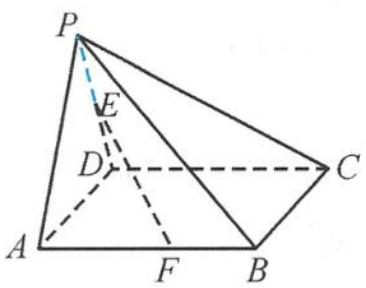
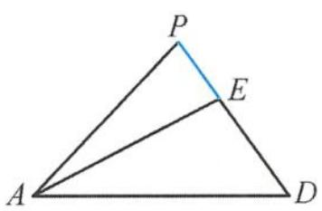
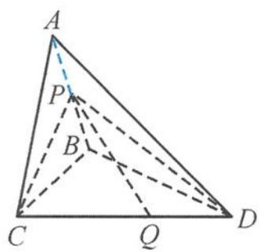
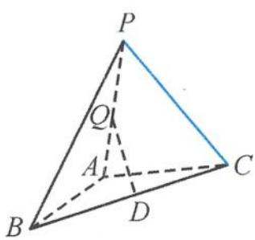
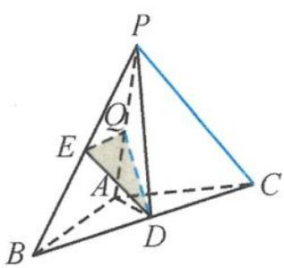

> [!faq]- 《浙大优辅《高中数学新体系 立体几何的秘密》》例题解析
>
> > [!success]- **【答案】** B
>
> > [!note]- **【分析】**
> > 本题未单列分析。
>
> > [!note]- **【解析】**
> > 
> > 图3.4-16
> > 
> > 图3.4-17
> > 解答 因为 $AB \perp$ 平面 PAD, 所以平面 $PAD \perp$ 平面 ABE, $\angle PAE$ 为 PA 与平面 ABE 所成的角 (图 3.4-17).
> > 由最小角定理知: PA 与平面 ABE 所成的角 $\leqslant$ PA 与 EF 所成的角, 即
> > $$
> > \angle P A E \leqslant 3 0 ^ {\circ}.
> > $$
> > 从而
> > $$
> > \tan \angle P A E = \frac {P E}{P A} = \frac {P E}{\sqrt {2}} \leqslant \tan 3 0 ^ {\circ},
> > $$
> > 所以 $0 < PE \leqslant \frac{\sqrt{6}}{3}$ . 而 $PA$ 与 $EF$ 为异面直线, 故
> > $$
> > 0 <   P E <   \frac {\sqrt {6}}{3}.
> > $$
> > 因此选B.
> > 
> > 引申1 如图3.4-18, 在三棱锥A-BCD中, 已知平面 $ABC \perp$ 平面BCD, △BAC与△BCD均为等腰直角三角形, 且 $\angle BAC = \angle BCD = 90^\circ$ , BC = 2. 点P是线段AB上的动点. 若线段CD上存在点Q, 使得异面直线PQ与AC成 $30^\circ$ 的角, 则线段PA长的取值范围是( ). A. $(0, \frac{\sqrt{2}}{2})$ B. $(0, \frac{\sqrt{6}}{3})$ C. $(\frac{\sqrt{2}}{2}, \sqrt{2})$ D. $(\frac{\sqrt{6}}{3}, \sqrt{2})$
> > 图3.4-18
> > 解答 因为 $CD \perp$ 平面 $ABC$ , 所以平面 $ABC \perp$ 平面 $PCD$ , 所以 $\angle ACP$ 为 $AC$ 与平面 $PCD$ 所成的角.
> > 又因为 AC 与平面 PCD 所成的角 $\leqslant AC$ 与 PQ 所成的角, 从而
> > $$
> > \tan \angle A C P = \frac {A P}{A C} \leqslant \tan 3 0 ^ {\circ},
> > $$
> > 所以 $0 < AP \leqslant \frac{\sqrt{6}}{3}$ . 而 $PQ$ 与 $AC$ 为异面直线, 从而
> > $$
> > 0 <   A P <   \frac {\sqrt {6}}{3}.
> > $$
> > 因此选B.
> > 引申 2 如图 3.4-19, 在 $\triangle ABC$ 中, 已知 $AB = 1$ , $BC = 2\sqrt{2}$ , $\angle ABC = \frac{\pi}{4}$ . 将 $\triangle ABC$ 绕边 $AB$ 翻转至 $\triangle ABP$ , 使平面 $ABP \perp$ 平面 $ABC$ , $D$ 是 $BC$ 的中点. 设 $Q$ 是线段 $PA$ 上的动点, 当 $PC$ 与 $DQ$ 所成的角取得最小值时, 线段 $AQ$ 的长度为 \_\_\_\_.
> > 
> > 图3.4-19
> > 
> > 图3.4-20
> > 解答 如图 3.4-20, 设 PB 的中点为 E, 连接 DE, 则 DE // PC. 可知 PC 与 DQ 所成的角即为 DE 与 DQ 所成的角 $\angle EDQ$ , 连接 AD, PD.
> > 根据最小角定理可知, $\angle EDQ$ 的最小值当且仅当 $\angle EDQ$ 为直线 $DE$ 与平面 $PAD$ 所成的线面角时取得. 因为
> > $$
> > A B = 1, B D = \frac {1}{2} B C = \sqrt {2}, B = \frac {\pi}{4},
> > $$
> > 所以
> > $$
> > A D = \sqrt {A B ^ {2} + B D ^ {2} - 2 A B \cdot B D \cdot \cos \frac {\pi}{4}} = 1.
> > $$
> > 故 $AD^2 + AB^2 = BD^2$ ，即
> > $$
> > D A \perp A B.
> > $$
> > 平面 $ABP \perp$ 平面 $ABC$ 且交线为直线 $AB$ , 故 $DA \perp$ 平面 $PAB$ , 得平面 $PAD \perp$ 平面 $PAB$ . 当 $EQ \perp AP$ 时, 有 $EQ \perp$ 平面 $PAD$ . 此时 $\angle EDQ$ 为直线 $DE$ 与平面 $PAD$ 的线面角. 又
> > $$
> > A P ^ {2} = B P ^ {2} + B A ^ {2} - 2 B P \cdot B A \cos \frac {\pi}{4} = 8 + 1 - 2 \times 2 \sqrt {2} \times 1 \times \frac {\sqrt {2}}{2} = 5,
> > $$
> > 故 $AP = \sqrt{5}$ . 在 $\triangle ABP$ 中, 由余弦定理得
> > $$
> > \cos \angle B P A = \frac {3}{\sqrt {1 0}}.
> > $$
> > 故
> > $$
> > P Q = P E \cos \angle B P A = \sqrt {2} \times \frac {3}{\sqrt {1 0}} = \frac {3}{\sqrt {5}} = \frac {3 \sqrt {5}}{5},
> > $$
> > 此时
> > $$
> > A Q = A P - Q P = \sqrt {5} - \frac {3 \sqrt {5}}{5} = \frac {2 \sqrt {5}}{5}.
> > $$
> > 故线段 AQ 的长度为 $\frac{2\sqrt{5}}{5}$ .
> > 点评 熟悉的问题,不同的背景,同样的方法,这就是例6及其两个引申的本质.
