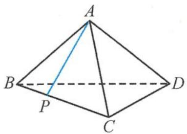
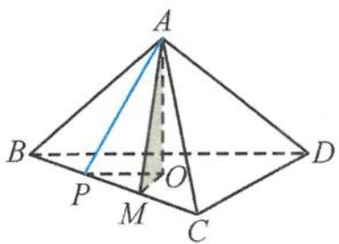
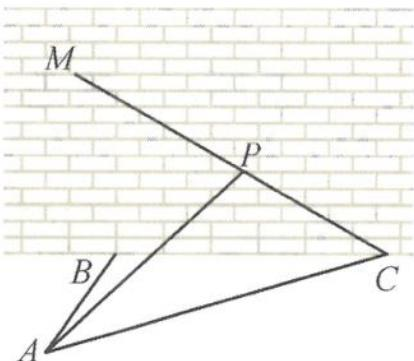
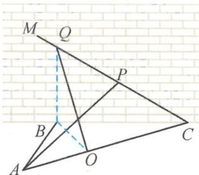
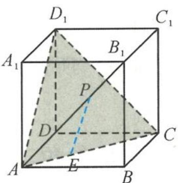
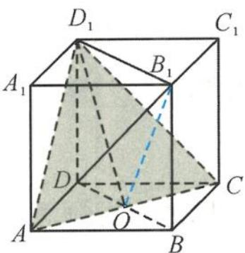

> [!faq]- 《浙大优辅《高中数学新体系 立体几何的秘密》》例题解析
>
> > [!success]- **【答案】** A
>
> > [!note]- **【分析】**
> > 本题未单列分析。
>
> > [!note]- **【解析】**
> > 
> > 图3.4-21
> > 
> > 图3.4-22
> > 解答 如图 3.4-22, 过点 A 作 $AM \perp BC$ , $AO \perp$ 平面 BCD, 垂足为 O. 连接 OM, 则 $\angle AMO$ 为二面角 A-BC-D 的平面角, 所以
> > $$
> > \angle A M O = 6 0 ^ {\circ}.
> > $$
> > 在直线 BC 上任取一点 P，连接 OP, AP，则 $\angle APO$ 为直线 AP 与平面 BCD 所成的角，即
> > $$
> > \angle A P O = \theta .
> > $$
> > 因为 $AP \geqslant AM, AM \sin 60^{\circ} = AO, AP \sin \theta = AO$ ，所以
> > $$
> > \sin \theta \leqslant \sin 6 0 ^ {\circ}.
> > $$
> > 又 $\theta \in [0^{\circ}, 90^{\circ}]$ , 故 $\theta$ 的最大值为 $60^{\circ}$ , 答案选 A.
> > 点评 本题的解答过程本质上是在推导最大角定理.
> > 引申1 在正四面体ABCD中,已知异面直线AB与CD所成的角为α,直线AB与平面BCD所成的角为β,二面角C-AB-D的平面角为γ.若 $a=\cos\alpha,b=\cos\beta,c=\cos\gamma$ ,则a,b,c的大小关系为(). A.c<a<b B.c<b<a C.a<b<c D.a<c<b
> > 解答 在正四面体 $ABCD$ 中, 对棱相互垂直, 所以异面直线 $AB$ 与 $CD$ 所成的角
> > $$
> > \alpha = 9 0 ^ {\circ}.
> > $$
> > 由最大角定理知
> > $$
> > \beta <   \gamma <   9 0 ^ {\circ} = \alpha .
> > $$
> > 由余弦函数的单调性知 $\cos \beta >\cos \gamma >\cos \alpha$ ，即
> > $$
> > a <   c <   b.
> > $$
> > 故选D.
> > 引申 2 如图 3.4-23, 某人在垂直于水平地面 ABC 的墙面前的点 A 处进行射击训练. 已知点 A 到墙面的距离为 AB, 某目标点 P 沿墙面上的射线 CM 移动. 此人为了准确瞄准目标点 P, 需计算由点 A 观察点 P 的仰角 $\theta$ 的大小. 若 AB = 15 m, AC = 25 m, $\angle BCM = 30^{\circ}$ , 则 $\tan \theta$ 的最大值是 \_\_\_\_. (仰角 $\theta$ 为直线 AP 与平面 ABC 所成的角)
> > 
> > 图3.4-23
> > 解答 由最大角定理得
> > $$
> > \theta_ {\mathrm{max}} = \text { 二面角 } P - A C - B.
> > $$
> > 如图 3.4-24, 由于墙面与地面垂直, 所以过点 B 作 BC 的垂线, 交 MC 于点 Q, 则 $BQ \perp$ 平面 ABC, 过点 B 作 AC 的垂线, 垂足为 O, 连接 QO.
> > 由三垂线定理得
> > $$
> > Q O \perp A C.
> > $$
> > 
> > 所以 $\angle BOQ$ 为二面角 $P - AC - B$ 的平面角. 因为 $QB = \frac{20\sqrt{3}}{3}, OB = 12$ , 所以
> > 图3.4-24
> > $$
> > \tan \angle B O Q = \frac {B Q}{B O} = \frac {5 \sqrt {3}}{9}.
> > $$
> > 故 $(\tan \theta)_{\mathrm{max}} = \frac{5\sqrt{3}}{9}.$
> > 点评 利用最大角定理巧妙地化动为静, 把动的线面角转化为求定的二面角.
> > 引申 3 如图 3.4-25, 在正方体 $ABCD-A_{1}B_{1}C_{1}D_{1}$ 中, 已知点 $P$ 在 $AB_{1}$ 上运动 (不包括端点), 点 $E$ 在 $AC$ 上运动 (不包括端点). 设 $EP$ 与平面 $ACD_{1}$ 所成的角为 $\theta$ , 则 $\cos \theta$ 的最小值是 ( ).
> > A. $\frac{1}{3}$ B. $\frac{\sqrt{3}}{3}$ C. $\frac{\sqrt{5}}{3}$ D. $\frac{\sqrt{6}}{3}$
> > 
> > 图3.4-25
> > 
> > 图3.4-26
> > 解答 由最大角定理得, $\theta$ 的最大角为二面角 $D_{1}-AC-B_{1}$ . 如图3.4-26, 连接 $BD$ , 交 $AC$ 于 $O$ 点, 连接 $OD_{1}, OB_{1}, B_{1}D_{1}$ . 由于 $AC \perp$ 平面 $DBB_{1}D_{1}$ , 所以 $\angle D_{1}OB_{1}$ 为二面角 $D_{1}-AC-B_{1}$ 的平面角.
> > 在 $\triangle D_{1}OB_{1}$ 中，由余弦定理求得
> > $$
> > \cos \theta = \frac {1}{3}.
> > $$
> >
> > 故选 **A**.
