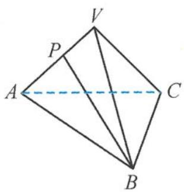

> [!faq]- 《浙大优辅《高中数学新体系 立体几何的秘密》》例题解析
>
> > [!success]- **【答案】** B
>
> > [!note]- **【分析】**
> > 本题未单列分析。
>
> > [!note]- **【解析】**
> > 
> > 图3.4-27
> > 解答 由最小角定理得
> > $$
> > \beta <   \alpha .
> > $$
> > 因为三棱锥为正三棱锥,所以二面角 P-AC-B 的平面角等于二面角 V-AB-C 的平面角.再由最大角定理得
> > $$
> > \beta <   \gamma .
> > $$
> >
> > 故选 **B**.
