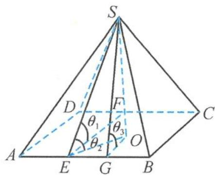
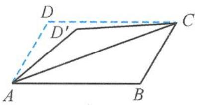
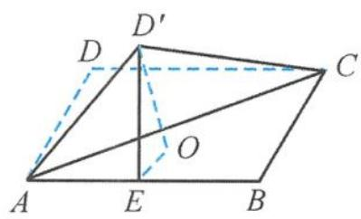
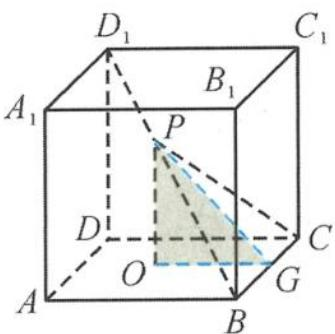
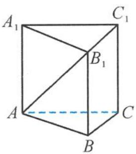
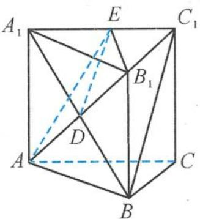
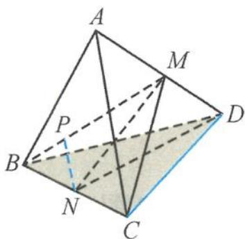

> [!faq]- 《浙大优辅《高中数学新体系 立体几何的秘密》》例题解析
>
> > [!success]- **【答案】** C
>
> > [!note]- **【分析】**
> > 本题未单列分析。
>
> > [!note]- **【解析】**
> > 解答 由最小角定理得
> > $$
> > \theta_ {2} \leqslant \theta_ {1}.
> > $$
> > 由最大角定理得
> > $$
> > \theta_ {2} \leqslant \theta_ {3}.
> > $$
> > 如图 3.4-28, 设顶点 S 在底面 ABC 上射影为 O, 过点 O 作 $OG \perp AB$ , 连接 SG, 则 $SG \perp AB$ . 因此 $\angle SGO$ 为二面角 S-AB-C 的平面角, 所以
> > $$
> > \theta_ {3} = \angle S G O.
> > $$
> > 
> > 因为 $GO \parallel BC$ , 所以 $\angle SGO$ 可以看作 $BC$ 与平面 $SEG$ 所成的角. 由最小角定理得
> > $$
> > \theta_ {3} \leqslant \theta_ {1}.
> > $$
> > 图3.4-28
> > 所以
> > $$
> > \theta_ {2} \leqslant \theta_ {3} \leqslant \theta_ {1}.
> > $$
> > 故选D.
> > 引申1 如图3.4-29, 已知四边形ABCD为矩形, 沿AC将△ADC翻折成△AD'C. 设二面角D'-AB-C的平面角为θ, 直线AD'与直线BC所成的角为θ₁, 直线AD'与平面ABC所成的角为θ₂. 当θ为锐角时, 有( ). A. θ₂ ≤ θ₁ ≤ θ
> > B. θ₂ ≤ θ ≤ θ₁
> > C. θ₁ ≤ θ₂ ≤ θ
> > D. θ ≤ θ₂ ≤ θ₁
> > 
> > 图3.4-29
> > 解答 由最小角定理得
> > $$
> > \theta_ {2} \leqslant \theta_ {1}.
> > $$
> > 由最大角定理得
> > $$
> > \theta_ {2} \leqslant \theta .
> > $$
> > 如图 3.4-30, 设点 $D'$ 在平面 $ABC$ 上射影为 $O$ , 过点 $O$ 作 $OE \perp AB$ , 连接 $D'E$ , 则 $D'E \perp AB$ . 因此 $\angle D'EO$ 为二面角 $D'-AB-C$ 的平面角, 所以
> > $$
> > \theta = \angle D ^ {\prime} E O.
> > $$
> > 因为 $EO \parallel BC$ , 所以 $\angle D'EO$ 可以看作 $BC$ 与平面 $D'AE$ 所成的角. 由最小角定理得
> > $$
> > \theta \leqslant \theta_ {1}.
> > $$
> > 
> > 图3.4-30
> > 所以
> > $$
> > \theta_ {2} \leqslant \theta \leqslant \theta_ {1}.
> > $$
> > 故选 B.
> > 引申 2 在正方体 $ABCD-A_{1}B_{1}C_{1}D_{1}$ 中, 已知 P 是线段 $BD_{1}$ (不含端点) 上的点, 记直线 PC 与直线 AB 所成的角为 $\alpha$ , 直线 PC 与平面 ABC 所成的角为 $\beta$ , 二面角 P-BC-A 的平面角为 $\gamma$ , 则 ( ). A. $\beta < \gamma < \alpha$ B. $\beta < \alpha < \gamma$ C. $\alpha < \gamma < \beta$ D. $\alpha < \beta < \gamma$
> > 解答 由最小角定理得
> > $$
> > \beta <   \alpha .
> > $$
> > 由最大角定理得
> > $$
> > \beta <   \gamma .
> > $$
> > 
> > 如图 3.4-31, 设点 P 在平面 ABC 上射影为 O, 过点 O 作 $OG \perp BC$ , 连接 PG, 则 $PG \perp BC$ . 因此 $\angle PGO$ 为二面角 P-BC-A 的平面角, 所以
> > $$
> > \gamma = \angle P G O.
> > $$
> > 图3.4-31
> > 因为 $GO \parallel AB$ , 所以 $\angle PGO$ 可以看作 $AB$ 与平面 $PBC$ 所成的角. 由最小角定理得
> > $$
> > \gamma <   \alpha .
> > $$
> > 所以
> > $$
> > \beta <   \gamma <   \alpha .
> > $$
> > 故选A.
> > 点评 其实,例9及其引申1与引申2这三个问题属于同一个问题,只不过把相同的问题放在不同的几何载体中呈现,这也是立体几何要训练一种能力,需要在不同的背景下洞察问题的本质.
> > 引申 3 如图 3.4-32, 已知三棱柱 $ABC - A_{1}B_{1}C_{1}$ 的所有棱长均相等, 侧棱 $AA_{1} \perp$ 平面 $ABC$ . 过 $AB_{1}$ 作与 $BC_{1}$ 平行的平面 $\alpha$ , 设平面 $\alpha$ 与平面 $ACC_{1}A_{1}$ 的交线为 $l$ , 记直线 $l$ 与直线 $AB$ , $BC, CA$ 所成的锐角分别为 $\alpha, \beta, \gamma$ , 则这三个角的大小关系为 ( ).
> > A. $\alpha > \gamma > \beta$ B. $\alpha = \beta > \gamma$ C. $\gamma > \beta > \alpha$ D. $\alpha > \beta = \gamma$
> > 
> > 图3.4-32
> > 
> > 图3.4-33
> > 解答 如图 3.4-33, 连接 $A_{1} B$ , 交 $A B_{1}$ 于点 $D$ , 取 $A_{1} C_{1}$ 的中点 $E$ , 则 $D E \parallel B C_{1}$ , 所以 $B C_{1} \parallel$ 平面 $A B_{1} E$ , 则平面 $\alpha$ 就是平面 $A B_{1} E$ , 交线 $l$ 就是直线 $A E$ .
> > AE 与 CA 所成的角 $\gamma$ 就是 AE 与平面 ABC 所成的角, 由最小角定理知 $\gamma$ 最小.
> > AB, BC 与 AE 在平面 ABC 内的射影 CA 所成的角相等, 所以
> > $$
> > \alpha = \beta ,
> > $$
> > 故
> > $$
> > \alpha = \beta > \gamma .
> > $$
> > 答案选B.
> > 引申 4 如图 3.4-34, 在正四面体 ABCD 中, 已知 M, N 分别为 AD, BC 的中点, P 为线段 MB 上的动点 (包括端点). 记 PN 与 CD 所成角的最小值为 $\alpha$ , PN 与平面 BCD 所成角的最大值为 $\beta$ , 则 ( ). A. $\alpha = \beta$ B. $\alpha > \beta$ C. $\alpha < \beta$ D. $\alpha + \beta = \frac{\pi}{2}$
> > 
> > 图3.4-34
> > 解答 由最小角、最大角定理知，PN 与 CD 所成的最小角为 CD 与平面 BCM 所成的角，即 $\angle DCM$ ; PN 与平面 BCD 所成的最大角为二面角 M-BC-D.
> > 在正四面体中,易得
> > $$
> > \tan \alpha = \tan \angle D C M = \frac {\sqrt {3}}{3}, \tan \beta = \tan \angle D N M = \frac {\sqrt {2}}{2},
> > $$
> > 则
> > $$
> > \alpha <   \beta .
> > $$
> >
> > 故选 **C**.
