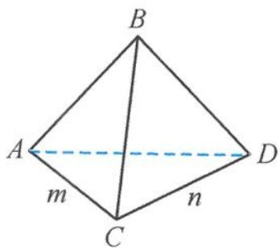
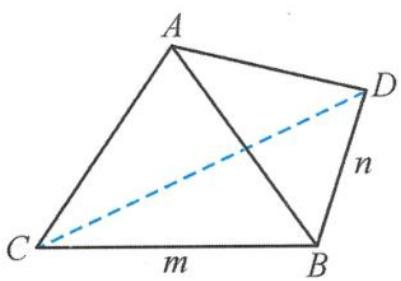

> [!faq]- 《浙大优辅《高中数学新体系 立体几何的秘密》》例题解析
>
> > [!success]- **【答案】** D
>
> > [!note]- **【分析】**
> > 本题未单列分析。
>
> > [!note]- **【解析】**
> > 解答 如图 3.4-35, 设 CA = m, CD = n, 四面体 ABCD 的高为 h, 则
> > $$
> > V _ {\text {四面体} A B C D} = \frac {1}{3} S _ {\triangle A C D} h = \frac {1}{3} \cdot \frac {1}{2} m n \sin 1 2 0 ^ {\circ} h = \frac {\sqrt {3}}{1 2} m n h.
> > $$
> > 因为
> > $$
> > A D ^ {2} = 9 = m ^ {2} + n ^ {2} - 2 m n \cos 1 2 0 ^ {\circ} \geqslant 3 m n,
> > $$
> > 
> > 图3.4-35
> > 所以
> > $$
> > m n \leqslant 3 \Rightarrow V _ {\text {四面体} A B C D} \leqslant \frac {\sqrt {3}}{4} h.
> > $$
> > 设 BC 与平面 ACD 所成的角为 $\theta$ ，由最小角定理得
> > $$
> > \theta \leqslant 6 0 ^ {\circ} \Rightarrow h = B C \sin \theta = 2 \sin \theta \leqslant 2 \sin 6 0 ^ {\circ} = \sqrt {3},
> > $$
> > 所以
> > $$
> > V _ {\mathrm{四面体} A B C D} \leqslant \frac {3}{4}.
> > $$
> > 故选D.
> > 引申 在四面体 ABCD 中, 已知二面角 A-BC-D 的大小为 $60^{\circ}$ , 且 AB = 2, CD = 4, $\angle CBD = 120^{\circ}$ , 则四面体 ABCD 体积的最大值是( ). A. $\frac{4\sqrt{3}}{9}$ B. $\frac{2\sqrt{3}}{9}$ C. $\frac{8}{3}$ D. $\frac{4}{3}$
> > 解答 如图 3.4-36, 设 BC = m, BD = n, 四面体 ABCD 的高为 h, 则
> > $$
> > V _ {\text {四面体} A B C D} = \frac {1}{3} S _ {\triangle B C D} h = \frac {1}{3} \cdot \frac {1}{2} m n \sin 1 2 0 ^ {\circ} h = \frac {\sqrt {3}}{1 2} m n h.
> > $$
> > 
> > 因为
> > $$
> > C D ^ {2} = 1 6 = m ^ {2} + n ^ {2} - 2 m n \cos 1 2 0 ^ {\circ} \geqslant 3 m n,
> > $$
> > 图3.4-36
> > 所以
> > $$
> > m n \leqslant \frac {1 6}{3} \Rightarrow V _ {\text {四面体} A B C D} \leqslant \frac {4 \sqrt {3}}{9} h.
> > $$
> > 设 AB 与平面 BCD 所成的角为 $\theta$ ，则由最大角定理得
> > $$
> > \theta \leqslant 6 0 ^ {\circ} \Rightarrow h = A B \sin \theta = 2 \sin \theta \leqslant 2 \sin 6 0 ^ {\circ} = \sqrt {3},
> > $$
> > 所以
> > $$
> > V _ {\mathrm{四面体} A B C D} \leqslant \frac {4}{3}.
> > $$
> > 故选D.
> > 点评 最大角定理与最小角定理在解决动态的空间图形问题时非常有用,往往能够化动为定,简化运算量.但最大角定理与最小角定理有其适用范围,即保证能取到最值,否则不能用.例如:
